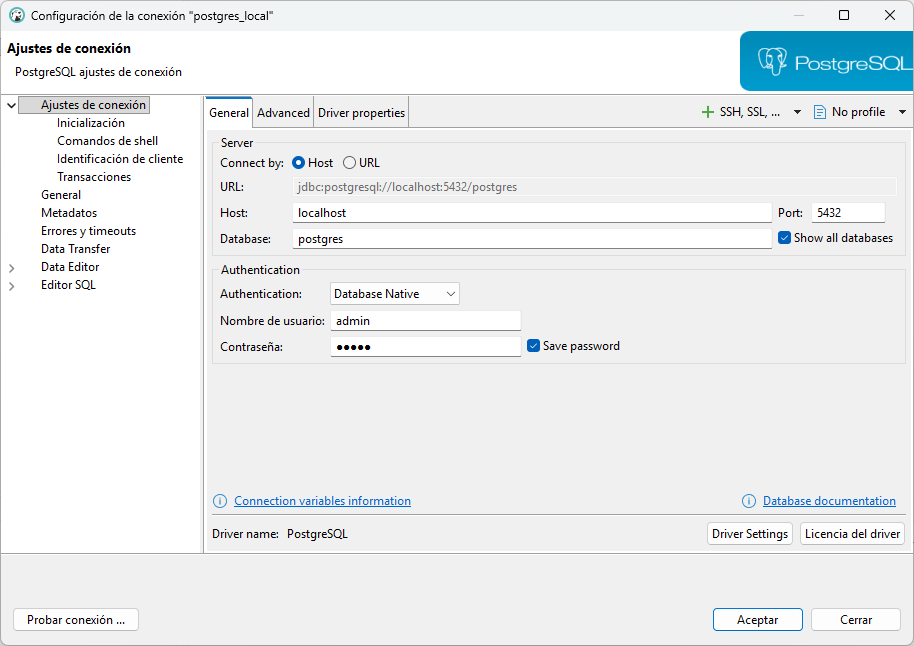
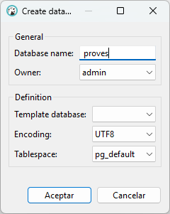

Hasta ahora hemos trabajado con un servidor PostgreSQL en la nube que tenía dos bases de datos: **geo y factura**.
En estas bases de datos únicamente hacíamos consultas (SELECT) y nadie modificaba la estructura ni los datos, por eso no existían conflictos.

A partir de ahora, con las sentencias de DDL y DML, haremos lo siguiente:

- **DDL** → crear y eliminar tablas, columnas, esquemas…
- **DML** → insertar, modificar y eliminar datos

Por tanto, no nos conviene en absoluto trabajar sobre la Base de Datos **geo** ni sobre **factura**, ya que lo que haríamos sería "boicotearnos" entre nosotros. 

Así, a partir de ahora, en lugar de hacer uso de un servidor alojado en la nube, trabajará con un servidor PostgreSQL de forma local, utilizando contenedores **Docker**. En cualquier caso, seguiremos utilizando el cliente **DBeaver** para conectarnos y gestionar la base de datos.
Trabajaremos con dos Bases de Datos **nuevas** en local utilizando contenedores:

- **pruebas**: servirá para realizar pruebas, como su propio nombre indica. Todos los ejemplos del tema los realizaremos en esta BD.
- **factura_local**: tendrá una Base de Datos para cada uno en local. Es donde tendrá que trabajar los ejercicios.

Vamos a realizar la instalación: 

## 1.1 Instalación de Docker

**🔹Windows**{.azul}

1) Verifica los requisitos y activa la virtualización/WSL2:  
>Activa WSL 2 y comprueba la versión con: **wsl --version**{.verde} (Si no aparece, instala/actualiza con: **wsl --install**{.verde} / **wsl --update**{.verde}).  

2) Instala Docker Desktop: [https://www.docker.com/products/docker-desktop](https://www.docker.com/products/docker-desktop)   
3) Asegúrate de que Docker Compose está disponible (normalmente viene incluido con Docker Desktop):  
>Ejecuta: **docker compose version**{.verde} y, si responde con una versión (por ejemplo, “Docker Compose version vX.Y.Z”), está instalado y accesible en tu PATH.  

**🔹Ubuntu**{.azul} (en las aulas del centro educativo no hace falta realizar la instalación)

1) Instala Docker: 

    sudo apt update
    sudo apt install docker.io

2) Instala Docker Compose:

    sudo apt install docker-compose

## 1.2 PostgreSQL con Docker Compose

1) En una carpeta, por ejemplo, **docker/postgres_local**{.verde}, **crea el archivo** vacío **docker-compose.yml**{.verde}.
  El archivo **docker-compose.yml**{.verde} define el contenedor de PostgreSQL, su configuración y los puertos para conectarse desde DBeaver. 

Copia el siguiente contenido dentro del archivo **docker-compose.yml**{.verde}

    servicios:
      postgres:
        image: postgres:16.4
        container_name: postgres_local
        environment:
          POSTGRES_USER: admin
          POSTGRES_PASSWORD: admin
          POSTGRES_DB: postgres
        puertos:
          - "5432:5432"
        volúmenes:
          - postgres_fecha:/var/lib/postgresql/fecha

    
    volúmenes:
      postgres_fecha:

2) **Alza el servicio**:  
  En la carpeta donde está el **docker-compose.yml**{.verde}, ejecuta en la terminal:

    docker compose up -d

**Explicación de los principales campos:**

- **image**: indica qué imagen de PostgreSQL utilizar (en este ejemplo, la versión 16.4).  
- **container_name**: nombre que tendrá el contenedor.   
- **environment**: define el usuario, la contraseña y la base de datos que se crearán inicialmente.  
- **puertos**: mapea el puerto local 5432 al puerto 5432 del contenedor, permitiendo conectarse desde DBeaver.  
- **volumas**: mantiene los datos persistentes aunque el contenedor se detenga o se vuelva a crear.  

!!!Note "Consejo"
     Puedes personalizar POSTGRES_USER, POSTGRES_PASSWORD y POSTGRES_DB según las necesidades de tu proyecto.

## 1.3 Crear una conexión desde DBeaver al servidor PostgreSQL creado con Docker
Una vez que el contenedor PostgreSQL está en funcionamiento, puedes conectarte desde DBeaver siguiendo estos pasos:

1) Abre DBeaver y conéctate al servidor PostgreSQL utilizando las credenciales definidas en el **docker-compose.yml**{.verde}.   
2) Haz clic en **Database → New Database Connection**.   
3) Selecciona **PostgreSQL** y haz clic en Next.  
4) Introduce los datos de conexión definidos en el archivo docker-compose.yml:  

  - **Host**: **localhost**{.verde}
  - **Puerto**: **5432**{.verde}
  - **Database**: **Postgres**{.verde}
  - **Username**: **admin**{.verde}
  - **Password**: **admin**{.verde}

 

5) Haz clic en **Test Connection/Probar Conexión** para comprobar que la conexión funciona correctamente.  
6) Si todo es correcto, haz clic en **Aceptar**. Ahora podrás ver y gestionar la base de datos PostgreSQL desde DBeaver.

!!!Note "Nota"
    Si tienes problemas de conexión, comprueba que el contenedor está en funcionamiento con **docker ps** y que el puerto **5432** no está ocupado por otro servicio.

## 1.4 Crear bases de datos dentro de la conexión postgres_local

Creamos las bases de datos **pruebas** y **factura_local** dentro de la conexión **postgres_local** porque esta conexión corresponde al servidor PostgreSQL que tenemos instalado en local con **Docker**.

1) Haz clic derecho sobre la conexión: **postgres_local**.  
2) Selecciona: **Create → Database**  
3) En la ventana escribe el nombre de la base de datos: **pruebas**  

4) Haz clic derecho sobre la conexión **postgres_local**.  
5) Pulsa **Refresh / Actualizar**.  
6) Comprueba que aparece la base de datos pruebas en la lista.  
**7) Da los mismos pasos para la base de datos:**{.rojo} **factura_local**

!!!Warning "IMPORTANTE"
    Le recomiendo que se cree otra conexión para cada una de las Bases de Datos anteriores. De esta manera, seguramente tendrá tres conexiones: la de **postgres_local** , la de **factura_local** y la de **pruebas**, además de las conexiones al servidor en la nube, **geo** y **factura**.

<!--
Hasta el momento sólo hemos visto una sentencia, el SELECT, una sentencia muy
potente para poder consultar el contenido de las tablas de una Base de Datos.
Pero el lenguaje SQL es más completo, y permite también crear la estructura de
las tablas y otros objetos. Y también nos permitirá manipular la información,
introduciendo datos nuevos, eliminando o modificando los ya existentes.

Durante toda esta parte de SQL realizaremos consultas para crear o
modificar tablas.

No nos conviene en absoluto trabajar sobre la Base de Datos **geo** ni sobre **factura** , ya que lo que haríamos sería "boicotearnos" entre nosotros.

Trabajaremos con dos Bases de Datos nuevos:

  * **pruebas** (conectándonos como el usuario **pruebas**): servirá para hacer pruebas, como su propio nombre indica. Todos los ejemplos los haremos en esta BD
  * **f_grup_9999x** , donde grupo es el código de su grupo (p.ej. 1cfsg, 1cfsj, 1cfsl...), 9999 serán las 4 últimas cifras de su DNI, y x es la letra de su NIF. Es decir, tendrá una Base de Datos para cada uno de ustedes, y un usuario con el mismo nombre. Es donde tendrá que trabajar los ejercicios.

Le recomiendo vivamente que se cree otra conexión para cada una de las
Bases de datos anteriores. De esta manera, seguramente tendrá cuatro
conexiones: la de **geo** , la de **factura** , la de **pruebas** y la de **pruebas**
**f_grup_9999x** (sustituyendo por los datos de su grupo y NIF)

-->

Licenciado bajo la [Licencia Creative Commons Reconocimiento NoComercial
CompartirIgual 3.0](http://creativecommons.org/licenses/by-nc-sa/3.0/)

