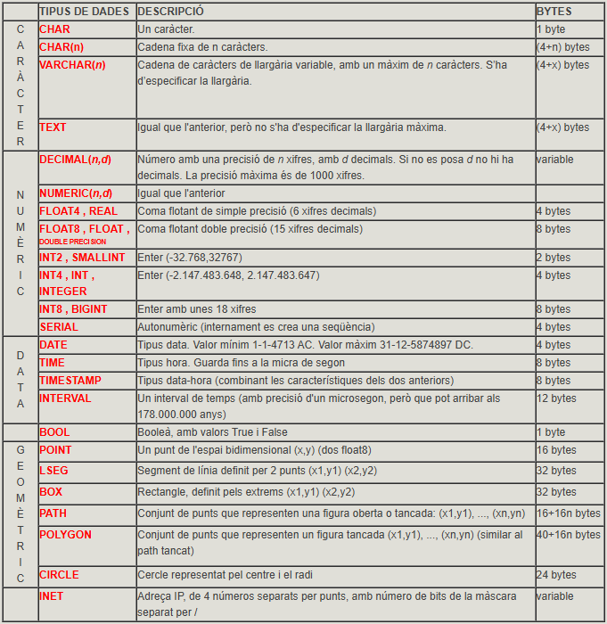
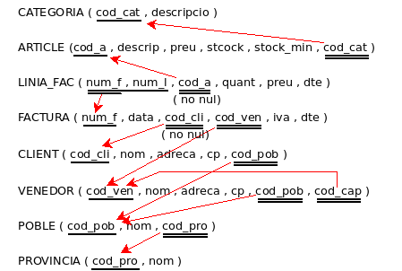
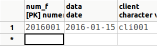
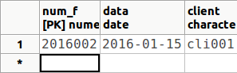
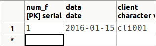
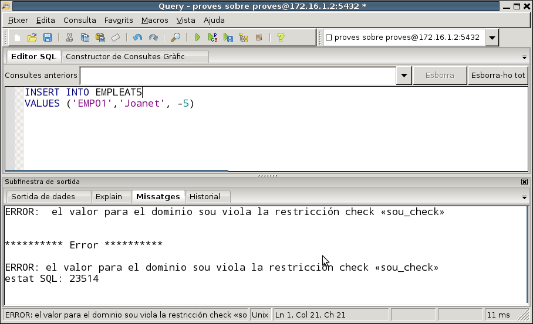
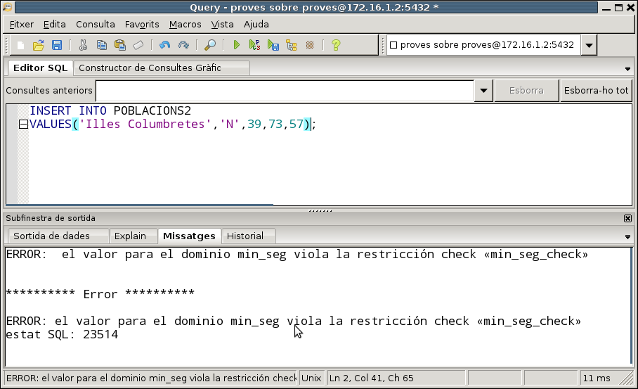
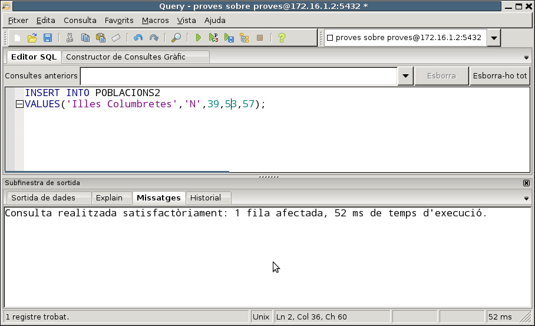
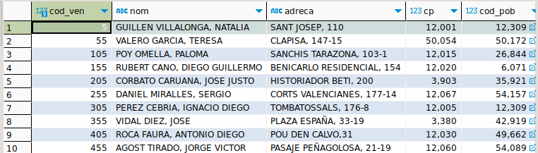
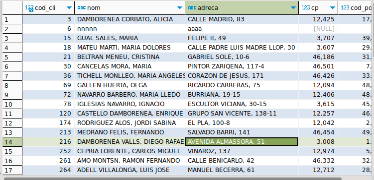

**DDL**(_Data Definition Language_) o **Lenguaje de Definición de Datos** es
el conjunto de sentencias que nos permiten definir, retocar o borrar
la estructura de la Base de Datos. Y como la estructura básica de una Base de
Datos Relacional es la mesa, nos dedicaremos básicamente a estudiar las
sentencias que nos permiten definir las tablas (o modificarlas o borrarlas)
las), con todas las restricciones que hemos visto en el Modelo Relacional: clave
principal, claves externas, campos no nulos, ... También veremos otros objetos que
podremos definir, sobre todo **vistas** , que se corresponden con el esquema externo
que vimos en el Tema 1, es decir, la visión particular que puede tener un
usuario.

Serán 3 sentencias las que veremos:

  * **CREATE** , que permite crear un objeto nuevo.

  * **DROP** , que permite borrar un objeto ya existente.

  * **ALTER** , que permite modificar un objeto ya existente.

En el momento de crear una tabla definiremos todos sus campos, con las
restricciones pertinentes en cada uno de ellos. Cada campo deberá ser de un tipo
de datos. En cada SGBD existen unos tipos de datos particulares, aunque los
más básicos son similares, y en ellos será donde incidiremos más.

## 2.1 Tipo de datos

En el momento de definir un campo deberemos especificar obligatoriamente de cuál
tipos será. Ya se vieron los tipos básicos de Access en el tutorial del tema
5. Ahora veremos los tipos básicos de **PostgreSQL** , y veremos que habrá
muchos tipos similares (como en todos los SGBD).

En el siguiente cuadro se resumen los tipos de datos más importantes de
PostgreSQL. Es un conjunto muy extenso, que incluso puede ampliar el usuario con
la instrucción **CREATE TYPE**, como veremos al final del tema. Son especialmente
interesantes los tipos geométricos (con **_POINT_** , **_BOX_** ,...) y el INET
(dirección IP).

  
También dispondremos de un tipo enumerado. Lo veremos en la última pregunta del tema.

En la documentación de PostgreSQL encontraremos todos los tipos posibles:   
><http://www.postgresql.org/docs/9.5/static/datatype.html>

## 2.2 CREATE TABLE

Permite crear una nueva mesa. Obligatoriamente se tendrán que especificar los campos
y los tipos de datos de cada campo. Obviamente, una vez creada la mesa
estará vacía, sin fila alguna.

**<u>Sintaxi</u>**

    CREATE TABLE mesa  
      ( campo1 tipo [(tamaño)] [DEFAULT valor] [restricción11] [restricción12] [...]  
      [, campo2 tipo [(tamaño)] [DEFAULT valor] [restricción21] [restricción22][...]  
      [, ...]]  
      [, restricciónmultiple1 [, ...]] )

Podemos observar que la definición de la estructura de la mesa va entre
paréntesis, separando por comas la definición de cada campo.

  * El nombre de la tabla no debe ser el de ningún otro objeto anterior (tabla o vista). Si queremos poner un nombre con más de una palabra o con una palabra reservada, deberemos ponerlo entre comillas dobles; pero no se lo aconseje, es preferible la utilización del guión bajo, y así sólo es una palabra.

  * En cada campo pondremos su nombre y el tipo. Si el tipo de datos es VARCHAR, podremos poner opcionalmente el tamaño máximo (si no lo ponemos será de 255 en el caso de texto). Si el tipo de datos es NUMERIC, podremos poner opcionalmente el tamaño (número de cifras significativas) y número de cifras de la parte fraccionaria.

  * Podemos poner ocionalmente un valor por defecto con la cláusula **DEFAULT**. De esta forma, al introducir una nueva fila en la tabla, si no le ponemos valor en este campo, tomará el valor por defecto. En el valor se puede poner una constante del tipo del campo, o una expresión con funciones, siempre que devuelva un dato de los tipos del campo.

  * Podemos poner opcionalmente restricciones en cada campo. Deberán ir antes de la coma que separa del siguiente campo. También pueden haber restricciones que afectan a más de un campo, que preferiblemente pondremos al final de la definición de la tabla. Veremos las restricciones en el siguiente punto.

**<u>Ejemplos</u>**

Si desea practicar estos ejemplos, hágalo sobre la Base de Datos **pruebas**
(usuario **pruebas** , contraseña **pruebas**). Si le da error para que la tabla
que vaya a crear ya está creada la tabla, bórela primero, y vuelva a
ejecutar la sentencia.

  1) Crear una nueva tabla llamada **EMPLEAT1** con dos campos, uno llamado **dni** de tipo texto y longitud 10 y otro llamado **nombre****** con longitud 50.

      CREATE TABLE EMPLEADO1 (dny VARCHAR (10) , nombre VARCHAR (50));

  2) Crear una tabla llamada **EMPLEAT2** con un campo texto de 10 caracteres llamado **dni** ; otro campo de tipo texto de longitud predeterminada (255) llamado **nombre;** otro campo llamado **data_nacimiento** de tipo data; otro llamado **sueldo** de tipo numérico, con 6 cifras significativas, de las cuales 2 debe ser de la parte fraccionaria y un último llamado **departamento** de tipo numérico pequeño (INT2 o SMALLINT).

      CREATE TABLE EMPLEADO2  
            ( dni VARCHAR(10) ,  
            nombre VARCHAR ,  
            fecha_nacimiento DATE ,  
            sueldo NUMERIC(6,2) ,  
            departamento INT2 )

  3) Crear una tabla llamada **EMPLEAT3** como el del ejemplo anterior, pero con dos campos más al final: un campo llamado **poblacio** de tipo texto de 50 caracteres, y con el valor por defecto **Castellón** y un último llamado **data_incorporacio** de tipo fecha y valor por defecto la fecha de

      CREATE TABLE EMPLEADO3  
            ( dni VARCHAR(10) ,  
            nombre VARCHAR ,  
            fecha_nacimiento DATE ,  
            sueldo NUMERIC(6,2) ,  
            departamento INT2 ,  
            población VARCHAR(50) DEFAULT 'Castellón' ,  
            fecha_incorporacion DATE DEFAULT CURRENT_DATE )

### **:pencil2:Ejercicios {: .ejercicios-header}**

A lo largo de esta tercera parte, en el conjunto de ejercicios de DDL, crearemos
toda la estructura de la Base de Datos **FACTURA** , pero para no interferir
cada uno con los demás compañeros, cada uno se conectará a su Base de Datos
**factura_local**.  
El esquema Entidad-Relación y el esquema relacional que implementaremos será el
siguiente:

En la Base de Datos llamada **factura_local**:

> **Ex_1** - Cree la tabla **CATEGORÍA** , con los mismos campos y del mismo
> tipos que en la tabla CATEGORÍA de **FACTURA** , pero de momento sin clave
> principal ni ninguna otra restricción.
>
> **Ex_2** - Cree la tabla **ARTÍCULO** , también sin restricciones. 

!!!note "Nota"
    Durante todos estos ejercicios de DDL puede ser muy conveniente tener abiertas
    ambas conexiones: la de **FACTURA** (para ir consultando) y la de
    **factura_local** (para ir creando y modificando).

### **2.2.1 Restricciones (Constraint)**

Por medio de las restricciones podremos definir dentro de una tabla restricciones
de usuario como son la definición de la clave principal, claves externas, campos no
nulos y campos únicos.

Hay dos formas de definir restricciones: las que afectan a un único campo (y
que se ponen en la misma definición del campo) y las que afectan o pueden
afectar a más de un campo, que deben definirse separadamente de la definición
de los campos. Empecemos por las primeras, por ser más sencillas de entender:

#### **2.2.1.1 Restricciones de campo único**

Son restricciones que se ponen en la misma definición del campo y sólo
afectarán a este campo: van por tanto después del tipo de datos del campo y
antes de la coma de separación de los campos.

**<u>Sintaxi</u>**

      [ CONSTRAINT nombre ] {PRIMARY KEY | UNIQUE | NOTE NULL | REFERENCIAS tabla2 [(campo1)] | CHECK (_condición_)}

Si no ponemos nombre a la restricción (CONSTRAINT nombre) PostgreSQL le asignará
automáticamente un nombre. Esto puede resultar cómodo en ocasiones, para no haber
de inventarnos nombres para las restricciones, pero después nos limitaría a que
no podríamos retocar estas restricciones.

Los tipos de restricciones que podemos definir son:

**Restricción de clave principal**{.azul}

  * **PRIMARY KEY** : el campo será clave principal.

> Por ejemplo, de esta forma definiremos la tabla EMPLEAT3 (como la de
> el apartado anterior) con el campo dni como clave principal. Recuerde que lo ha
> de borrar primero (quizá no lo esté visualizando, pero sí que
> está creada; refresca constantemente las tablas para saber la situación
> actual)

      CREATE TABLE EMPLEADO3  
            ( dni VARCHAR(10) CONSTRAINT cp_emp3 PRIMARY KEY,  
            nombre VARCHAR ,  
            fecha_nacimiento DATE ,  
            sueldo NUMERIC(6,2) ,  
            departamento INT2 ,  
            población VARCHAR(50) DEFAULT 'Castellón' ,  
            fecha_incorporacion DATE DEFAULT CURRENT_DATE )

!!!Note "Nota"
    Puede comprobar que, si no pone nombre a la restricción, es decir, si pone
    directamente dni **TEXT(10) PRIMARY KEY**, y vaya al diseño de la mesa,
    PostgreSQL pone automáticamente un nombre a la restricción formado por el nombre de la tabla seguido de **_pkey**.

>> Tenga en cuenta también que si la mesa ya existía dará un error. Sólo
debe borrarla primero.

**Restricción de unicidad**{.azul}

  * **UNIQUE** : el campo será único, es decir, no se podrá tomar dos veces el mismo valor en este campo (_Indexado sin duplicados_ en Access). PostgreSQL generará automáticamente un índice para ese campo. Veremos qué es un índice en la pregunta 6.

> Por ejemplo, de esta forma definiríamos la tabla EMPLEAT3 con la restricción
> que el campo **nombre** no se puede repetir (si desea probar la sentencia hágalo
> en la BD **pruebas** , y si ya existe el borre primero):

      CREATE TABLE EMPLEADO3  
            ( dni VARCHAR(10) ,  
            nombre VARCHAR CONSTRAINT u_nombre UNIQUE,  
            fecha_nacimiento DATE ,  
            sueldo NUMERIC(6,2) ,  
            departamento INT2 ,  
            población VARCHAR(50) DEFAULT 'Castellón' ,  
            fecha_incorporacion DATE DEFAULT CURRENT_DATE )

**Restricción de valor no nulo**{.azul}

  * **NOT NULL** : el campo no podrá tomar un valor nulo (_Requerido_ en Access). Debemos ser conscientes de que no vale la pena definir como no nula la clave principal, puesto que por definición ya lo es.

> Por ejemplo, de esta forma definiremos que el campo **nombre** debe ser no
> nulo.

      CREATE TABLE EMPLEADO3  
            ( dni VARCHAR(10) ,  
            nombre VARCHAR CONSTRAINT nn_nombre NOT NULL ,  
            fecha_nacimiento DATE ,  
            sueldo NUMERIC(6,2) ,  
            departamento INT2 ,  
            población VARCHAR(50) DEFAULT 'Castellón' ,  
            fecha_incorporacion DATE DEFAULT CURRENT_DATE )

**Restricción de integridad referencial**{.azul}

  * **REFERENCIAS** : servirá para definir que este campo es una clave externa. Deberemos especificar obligatoriamente la tabla a la que apunta, y opcionalmente podemos poner entre paréntesis el campo de la tabla al que apunta, aunque si no lo ponemos, por defecto apuntará a la clave principal (y nosotros siempre querremos apuntar a la clave principal).

> Por ejemplo, de esta forma podemos definir la clave externa que apunta a la
> mesa DEPARTAMENTO (y que indica que el empleado pertenece al departamento). Antes
> de crear esta versión de EMPLEAT3, debemos tener creada la tabla
> DEPARTAMENTO, sino dará error:

      CREATE TABLE DEPARTAMENTO  
            ( num_d INT2 CONSTRAINT cp_dep PRIMARY KEY ,  
            nombre_d VARCHAR(50) ,  
            director VARCHAR(10) ,  
            fecha DATE );

      CREATE TABLE EMPLEADO3  
            ( dni VARCHAR(10) ,  
            nombre VARCHAR ,  
            fecha_nacimiento DATE ,  
            sueldo NUMERIC(6,2) ,  
            departamento INT2 CONSTRAINT ce_emp3_dep REFERENCIAS DEPARTAMENTO ,  
            población VARCHAR(50) DEFAULT 'Castellón' ,  
            fecha_incorporación DATE DEFAULT CURRENT_DATE );

> Como ya se vio en el tema del Modelo Relacional (restricciones de integridad referencial), hay 3 formas de actuar cuando se borra o se modifica una fila de la tabla
> principal que tiene asociadas filas en la tabla relacionada por medio de la clave
> externa. Por ejemplo, ¿qué hacemos con los familiares de un empleado si borramos
> ¿el empleado? Estas formas de actuar deben especificarse en el momento de
> definir la clave externa. La forma de ponerlas en SQL y el significado son
> las siguientes:
>
  - **NO ACTION** : no se dejará borrar o modificar de la tabla
> principal si tiene alguna fila relacionada. Es la opción por defecto. Así en
> el ejemplo de EMPLEAT3, con una clave externa que apunta a DEPARTAMENTO, si
> intentamos borrar o modificar el número de un departamento que tiene empleados,
> nos dará un mensaje de error, avisando de que cómo tiene registros relacionados en
> otra tabla no se puede borrar o modificar.
>

> - **CASCADE** : se borrarán (o modificarán) en cascada los registros
> relacionados de la tabla donde está la clave externa. Se especificará con **ON
> DELETE CASCADE** o **ON UPDATE CASCADE**.

      CREATE TABLE EMPLEADO3  
            ( dni VARCHAR(10) ,  
            nombre VARCHAR ,  
            fecha_nacimiento DATE ,  
            sueldo NUMERIC(6,2) ,  
            departamento INT2 CONSTRAINT ce_emp3_dep REFERENCIAS DEPARTAMENTO DÓNDE DELETE
            CASCADE DONDE UPDATE CASCADE ,  
            población VARCHAR(50) DEFAULT 'Castellón' ,  
            fecha_incorporacion DATE DEFAULT CURRENT_DATE )
>
> De esta manera si borramos un departamento de la mesa DEPARTAMENTO,
> se borrarán también los empleados de la mesa EMPLEADOS3 de este departamento.
> Y si en la mesa DEPARTAMENTO modificamos un número de departamento, por
> ejemplo de 5 a 50, este valor será el nuevo valor en el campo departamento de
> la mesa EMPLEAT3 para aquellos que antes tenían un 5.
>

> - **SET NULL** : pondrá a nulo el campo que es clave externa de los registros
> que estén relacionados con el borrado o modificado de la tabla principal.
> Así, si hicimos la siguiente definición de la tabla EMPLEAT3

        CREATE TABLE EMPLEADO3  
            ( dni VARCHAR(10) ,  
            nombre VARCHAR ,  
            fecha_nacimiento DATE ,  
            sueldo NUMERIC(6,2) ,  
            departamento INT2 CONSTRAINT ce_emp3_dep REFERENCIAS DEPARTAMENTO DÓNDE DELETE
            SIETE NULL ,  
            población VARCHAR(50) DEFAULT 'Castellón' ,  
            fecha_incorporacion DATE DEFAULT CURRENT_DATE )
>
> en caso de que borramos el departamento 5, no daría ningún error por ésta
> restricción de integridad, y pondría a nulo el departamento de aquellos empleados
> que antes eran del departamento 5.
>

   >- **SET DEFAULT**: Establece las columnas que referencian a sus valores por defecto. Debe existir una fila en la tabla referenicada que coincida con los valores por defecto, si no son NULL, o la operación fallará.

**Restricción externa**{.azul}

  * **CHECK** : realizará una comprobación para validar los valores introducidos para este campo. La condición de validación debe ir entre paréntesis, y debe ser una expresión, normalmente de comparación del campo en cuestión con algún valor.

Por ejemplo, vamos a exigir que el sueldo sea estrictamente positivo (por tipo de
datos numérico, podría tomar el valor 0 o valores negativos)

      CREATE TABLE EMPLEADO3  
            ( dni VARCHAR(10) ,  
            nombre VARCHAR ,  
            fecha_nacimiento DATE ,  
            sueldo NUMERIC(6,2) CONSTRAINT sueldo_positivo CHECK (sueldo > 0),  
            departamento INT2 ,  
            población VARCHAR(50) DEFAULT 'Castellón' ,  
            fecha_incorporacion DATE DEFAULT CURRENT_DATE )

Evidentemente se puede poner más de una restricción en la definición de una mesa. En
este ejemplo recogemos todas las anteriores, es decir, definimos la tabla
**EMPLEAT3** con todos sus campos, y definiendo la _clave principal_
(**dni**), con el campo **nombre** _único , con el **sueldo** _estrictamente positivo_, y con el campo **departament** que será _clave externa_ que apunta a la tabla
DEPARTAMENTO. Para complicarlo un poco más también exigiremos que el campo **nombre**
sea _no nulo_, y así ver que se puede poner más de una restricción en un campo.

    CREATE TABLE EMPLEADO3  
            ( dni VARCHAR(10) CONSTRAINT cp_emp3 PRIMARY KEY ,  
            nombre VARCHAR CONSTRAINT u_nombre UNIQUE CONSTRAINT nn_nombre NOT NULL ,  
            fecha_nacimiento DATE ,  
            sueldo NUMERIC(6,2) CONSTRAINT sueldo_positivo CHECK (sueldo > 0) ,  
            departamento INT2 CONSTRAINT ce_emp3_dep REFERENCIAS DEPARTAMENTO ,  
            población VARCHAR(50) DEFAULT 'Castellón' ,  
            fecha_incorporacion DATE DEFAULT CURRENT_DATE )

Observe que como cuestión de estilo se han puesto nombres a las restricciones que
de alguna forma sugieren el motivo de la restricción. Así, **cp_emp3** quiere
decir _clave princpal de EMPLEAT3_ , **u_nombre** significa que el campo _nombre_ es
_único_ , **nn_nombre** significa que _nombre_ es _no nulo_ , **nn_sou** significa que
_sou_ es _no nul_ , y **ce_emp3_dep** significa _clave externa de la tabla
EMPLEADO3 en la mesa DEPARTAMENTO_. Si tenemos un criterio claro para los nombres de las
restricciones, si después las queremos desactivar temporal o sencillamente
borrarlas, podremos hacerlo desde SQL.

#### **2.2.1.2 Restricciones de campo múltiple**

También se llaman restricciones de tabla, en contraposición a las anteriores, que
son restricciones de campo. Son restricciones que van dentro de la definición de una
tabla pero fuera de la definición de un campo, y que pueden afectar a uno o varios
campo. Deberá definirse expresamente a cuál o qué campos afectan.

**<u>Sintaxi</u>**

      [ CONSTRAINT nombre ] {PRIMARY KEY | UNIQUE | FOREIGN KEY | CHECK (_condicio_)} (c11 [,c12][,...])   
      [ REFERENCIAS tabla2 [ (c21 [,c22][,...]) ] ]  
      [ DONDE DELETE {CASCADE | SET NULL}] [DONDE UPDATE {CASCADE | SIETE NULL}] ]

Al igual que antes, si no ponemos nombre a la restricción (CONSTRAINT nombre) PostgreSQL
le asignará uno automáticamente, que será construido de forma muy lógica.

Observe que ahora siempre especificamos el o los campos afectados.

Los tipos de restricciones son los mismos que en el caso anterior, pero la
sintaxis variará ligeramente:

**Restricción de clave principal**{.azul}

  * **PRIMARY KEY** : pondremos entre paréntesis el campo o campos (en este caso separados por comas) que serán clave principal.

> Por ejemplo, definimos otra vez el campo dni como clave principal de la
> mesa EMPLEAT3

      CREATE TABLE EMPLEADO3  
            ( dni VARCHAR(10) ,  
            nombre VARCHAR ,  
            fecha_nacimiento DATE ,  
            sueldo NUMERIC(6,2) ,  
            departamento INT2 ,  
            población VARCHAR(50) DEFAULT 'Castellón' ,  
            data_incorporacion DATE DEFAULT CURRENT_DATE ,  
            CONSTRAINT cp_emp3 PRIMARY KEY (dny) )

> Y ahora otro para definir la clave principal de FAMILIAR. Cómo la clave está
> formada por 2 campos, estamos obligados a utilizar una restricción de campo
> múltiple.

      CREATE TABLE FAMILIAR  
            ( dni VARCHAR(10),  
            nombre VARCHAR,  
            data_n DATE,  
            parentesco VARCHAR(50),  
            CONSTRAINT cp_fam2 PRIMARY KEY (dny,nombre) )

> Como comentábamos, si la clave principal está formada por 2 campos estaremos
> obligados a utilizar una restricción de campo múltiple. Un **error**{.rojo} bastante común
> sería lo siguiente:

      CREATE TABLE FAMILIAR2
            ( dni VARCHAR(10) PRIMARY KEY,
            nombre VARCHAR PRIMARY KEY,
            data_n DATE,
            parentesco VARCHAR(50) )

> Puede comprobar que dará **error**{.rojo} , porque estamos intentando definir 2
> claves principales. La clave principal es única, eso sí formada por 2 campos en
> esta ocasión.

**Restricción de unicidad**{.azul}

  * **UNIQUE** : ahora pondremos entre paréntesis el o los campos que serán únicos (en su conjunto). PostgreSQL generará automáticamente un índice para esa combinación de campos. Veremos qué es un índice en la pregunta 6.

> Por ejemplo, modificamos la definición de EMPLEAT3 (llamándola EMPLEAT4) ,
> con un campo para los apellidos y un campo para el nombre. Definiremos la
> restricción de que los campos apellidos y nombre (en conjunto) no se pueden repetir.

      CREATE TABLE EMPLEADO4  
            ( dni VARCHAR(10),  
            apellidos VARCHAR,  
            nombre VARCHAR,  
            fecha_nacimiento DATE,  
            sueldo NUMERIC(6,2) ,  
            departamento INT2 ,  
            CONSTRAINT u_nombre4 UNIQUE (apellidos,nombre) )

**Restricción de valor no nulo**{.azul}

  * **NOT NULL**.

> No existe esta opción como restricción múltiple. Por tanto se debe
> definir siempre como restricción de campo único.

**Restricción de integridad referencial**{.azul}

  * **FOREIGN KEY** : servirá para definir que este o estos campos son una clave externa. Es la que más varía en su sintaxis, ya que debemos especificar tanto el o los campos de esta tabla que son clave externa, como la tabla a la que apunta (y en todo caso el o los campos donde se apunta, aunque si no lo ponemos apuntará a la clave principal de la otra tabla, lo que querremos siempre):

        [CONSTRAINT nombre] FOREIGN KEY (c11 [,c12][,...]) REFERENCIAS tabla2 [(c21 [,c22][,...])] [ON DELETE {CASCADE | SET NULL}] [DONDE UPDATE {CASCADE | SIETE NULL}]

> En el ejemplo de la clave externa que apunta a la mesa DEPARTAMENTO quedará
> así:

      CREATE TABLE EMPLEADO3  
            ( dni VARCHAR(10) ,  
            nombre VARCHAR ,  
            fecha_nacimiento DATE ,  
            sueldo NUMERIC(6,2) ,  
            departamento INT2 ,  
            población VARCHAR(50) DEFAULT 'Castellón' ,  
            data_incorporacion DATE DEFAULT CURRENT_DATE ,  
            CONSTRAINT ce_emp3_dep FOREIGN KEY (departamento) REFERENCIAS DEPARTAMENTO )

**Restricción externa**{.azul}

  * **CHECK** : ahora la condición de validación podrá afectar a más de un campo

Por ejemplo podríamos exigir que la fecha de incorporación sea estrictamente
posterior a la fecha de nacimiento

      CREATE TABLE EMPLEADO3  
            ( dni VARCHAR(10) ,  
            nombre VARCHAR ,  
            fecha_nacimiento DATE ,  
            sueldo NUMERIC(6,2) ,  
            departamento INT2 ,  
            población VARCHAR(50) DEFAULT 'Castellón' ,  
            data_incorporacion DATE DEFAULT CURRENT_DATE ,  
            CONSTRAINT check_dates CHECK (fecha_incorporación > fecha_nacimiento) )

Otro algo más real, vamos a coger empleados de más de 18 años, y
por tanto vamos a exigir que la fecha de incorporación sea más de 18 años
posterior a la fecha de nacimiento. Para ello utilizamos la función
**AGE(f1,f2)** que calcula el tiempo entre la fecha d2 y la fecha d1 (que debe
ser la posterior), y de ahí extraeremos los años con **EXTRACT(year FROM ...)**

      CREATE TABLE EMPLEADO3  
            ( dni VARCHAR(10) ,  
            nombre VARCHAR ,  
            fecha_nacimiento DATE ,  
            sueldo NUMERIC(6,2) ,  
            departamento INT2 ,  
            población VARCHAR(50) DEFAULT 'Castellón' ,  
            data_incorporacion DATE DEFAULT CURRENT_DATE ,  
            CONSTRAINT check_dates  
            CHECK (EXTRACT(year FROM AGE(fecha_incorporación,fecha_nacimiento) ) >=18 ) )

Evidentemente, se pueden mezclar las restricciones de campo único y las de campo
múltiplo. Aquí tenemos un ejemplo donde se recogen muchas (no todas) las
restricciones anteriores. Hemos puesto de campo múltiple la de los 18 años de los
empleados, porque no hay otro remedio, y también la de no repetición del campo
**nombre** , aunque podía ser de campo único:

    CREATE TABLE EMPLEADO3  
            ( dni VARCHAR(10) CONSTRAINT cp_emp3 PRIMARY KEY ,  
            nombre VARCHAR CONSTRAINT nn_nombre NOT NULL ,  
            fecha_nacimiento DATE ,  
            sueldo NUMERIC(6,2) CONSTRAINT sueldo_positivo CHECK (sueldo > 0) ,  
            departamento INT2 CONSTRAINT ce_emp3_dep REFERENCIAS DEPARTAMENTO ,  
            población VARCHAR(50) DEFAULT 'Castellón' ,  
            data_incorporacion DATE DEFAULT CURRENT_DATE ,  
            CONSTRAINT u_nombre3 UNIQUE (nombre) ,  
            CONSTRAINT check_dates  
            CHECK (EXTRACT(year FROM AGE(fecha_incorporación,fecha_nacimiento) ) >=18 ) )

### **:pencil2: Ejercicios {: .ejercicios-header}**

En **factura_local**:

> **Ex_3** - Crear la tabla **PROVINCIA** , con la clave principal.
>
> **Ex_4** - Crear la tabla **PUEBLO** , con la clave principal y la restricción
> que el campo **cod_pro** es clave externa que apunta a PROVINCIA.
>
> **Ex_5** - Crear la tabla **VENEDOR** , con la clave principal y la clave
> externa a PUEBLO (de momento no definimos la clave externa a VENDEDOR, que es
> reflexiva).
>
> **Ex_6** - Crear la tabla **CLIENTE** , con la clave principal y la clave externa
> en PUEBLO
>
> **Ex_7** - Crear la tabla **FACTURA** , con la clave principal y las claves
> externas a CLIENTE y VENDEDOR. También debe exigir que **cod_cli** sea no nulo.
>
> **Ex_8** - Crear la tabla **LINIA_FAC** , con la clave principal (observa que
> está formada por 2 campos) pero de momento sin la clave externa que apunta a
> ARTÍCULO. Además **cod_a** debe ser no nulo.

## 2.3 ALTER TABLE

Permite modificar la estructura de una tabla ya existente, bien añadiendo, levante o
modificando campos (columnas), bien añadiendo o quitando restricciones. También servirá
para cambiar el nombre de un campo e incluso cambiar el nombre de la tabla

**<u>Sintaxi</u>**

Para alterar la estructura de algún campo o restricción utilizaremos esta
sintaxis:

      ALTER TABLE mesa  
            {ADD | DROP | ALTER} {COLUMNO campo | CONSTRAINT restricción múltiple}

Para cambiar el nombre de un campo:

      ALTER TABLE mesa  
            RENAME [COLUMN] campo TO nuevo_nombre_campo

Para cambiar el nombre de la tabla:

    ALTER TABLE mesa  
      RENAME TO nuevo_nombre_tabla

**Añadir campo o restricción**{.azul}

Si queremos añadir una columna o una restricción, deberemos definirla totalmente.

  * En el caso de un campo, deberemos especificar el nombre, el tipo y opcionalmente una restricción que afecte sólo al campo. Por ejemplo, esta sentencia añade el campo supervisor (de tipo texto de 10) a la tabla EMPLEAT3. Observe que en la definición del campo pueden entrar restricciones de campo único.

        ALTER TABLE EMPLEADO3  
            ADD COLUMNO supervisor VARCHAR(10)

  * En el caso de una restricción, ésta será del tipo de restricción múltiple, con la sintaxis que vimos en el apartado de restricciones. Por ejemplo, esta sentencia añade la clave externa reflexiva (de EMPLEAT3 a EMPLEAT3) que indica los supervisores. El dni debería ser la clave principal de EMPLEAT3

        ALTER TABLE EMPLEADO3  
            ADD CONSTRAINT ce_emp3_emp3 FOREIGN KEY (supervisor) REFERENCIAS EMPLEAT3 (dni)

**Modificar un campo**{.azul}

Podemos hacer dos cosas: modificar el tipo del campo o modificar el valor por
defecto (poner valor por defecto o quitarlo)

Para cambiar el tipo deberemos utilizar la **sintaxis**... ALTER COLUMN _camp_
TYPE _nuevo_tipo_ **. Por ejemplo vamos a hacer que el campo poblacion sea de 25
caracteres

      ALTER TABLE EMPLEADO3  
            ALTER COLUMNO población TYPE VARCHAR(25)

Cambiar el tipo de datos es automático cuando los tipos son compatibles entre
ellos. Si no lo son nos dará error, pero seguramente podremos esquivarlo con la
cláusula**USING** , que nos permite poner a continuación el campo y aprovechamos por
a poner un **operador de conversión de tipos** (**::**) con esta **sintaxis**:

      ALTER TABLE _MESA_  
            ALTER COLUMNO _campo_ TYPE _tipo_nuevo_ USING _campo ::_tipo_nuevo_

Para cambiar el valor por defecto utilizaremos la **sintaxis**: **... ALTER COLUMN _camp_ {SET | DROP} DEFAULT [_expresión_] **

      ALTER TABLE EMPLEADO3  
            ALTER COLUMNO población DROP DEFAULT

**Borrar campo o restricción**{.azul}

Si queremos quitar un campo o una restricción es suficiente con especificar el nombre
del campo o de la restricción (por eso puede ser muy interesante dar nombre a las
restricciones). En el primer ejemplo quitamos la clave externa del supervisor. En
la segunda levantamos el campo supervisor.

      ALTER TABLE EMPLEADO3  
            DROP CONSTRAINT ce_emp3_emp3;

      ALTER TABLE EMPLEADO3  
            DROP COLUMN supervisor

**Renombrar un campo**{.azul}

Por ejemplo renombramos el campo **data_incorporacio** a **data_inc** :

      ALTER TABLE EMPLEADO3  
            RENAME COLUMN data_incorporacio TO data_inc

**Renombrar la tabla**{.azul}

Ahora le pondremos el nombre EMP3 en la mesa EMPLEAT3

      ALTER TABLE EMPLEADO3  
            RENAME TO EMP3

**<u>Ejemplos</u>**

  1) Modificar la tabla **EMP3** para añadir el campo cp (código postal) de tipo texto de 5 caracteres.

      ALTER TABLE EMP3 ADD COLUMNO cp VARCHAR(5);

  2) Modificar la tabla **EMP3** para modificar el campo anterior y que sea de tipo numérico.

      ALTER TABLE EMP3 ALTER COLUMNO cp TYPE NUMERIC(5) USING CP::NUMERIC;

  3) Modificar la tabla **EMP3** para añadir la restricción (aunque sea algo extraña) que no se puede repetir la combinación código postal y población.

      ALTER TABLE EMP3 ADD CONSTRAINT u_cp_pobl UNIQUE (cp,poblacio);

  4) Modificar la tabla **EMP3** para borrar la restricción anterior

      ALTER TABLE EMP3 DROP CONSTRAINT u_cp_pobl;

  5) Modificar la tabla **EMP3** para modificar el nombre del campo **cp** en **código_postal**

      ALTER TABLE EMP3 RENAME COLUMN cp TO código_postal;

  6) Renombrar la tabla **EMP3** a **EMPLEAT3**

      ALTERAR TABLA EMP3 RENOMBRAR A EMPLEADO3;

### **:pencil2: Ejercicios {: .ejercicios-header}**

En **factura_local**:

**Ex_9** - Añadir un campo a la tabla **VENEDOR** llamado **alias** de tipo
texto, que debe ser no nulo y único.

**Ex_10** - Borrar el campo anterior, **alies** , de la tabla **VENEDOR**.

**Ex_11** - Añadir la clave principal de **CATEGORÍA**.

**Ex_12** - En la tabla **ARTÍCULO** añadir la clave principal y la clave externa a
CATEGORÍA.

**Ex_13** - En la tabla **LINIA_FAC** añadir la clave externa que apunta a
FACTURA, **exigiendo que se borre en cascada** (si se borra una factura,
se borrarán automáticamente sus líneas de factura). Y también la clave
externa que apunta a ARTÍCULO (esta normal, es decir NO ACTION)

!!!note "Nota"
      Para no hacerlo demasiado largo, se han dejado de definir alguna restricción,
      concretamente la reflexiva de VENDEDOR a VENDEDOR (que marca la cabeza)

## 2.4 DROP TABLE

Nos servirá para borrar absolutamente una tabla, tanto datos como
la estructura. Hay que tener cuidado con ella, porque es una operación que no
se puede deshacer, y por tanto potencialmente muy peligrosa.

**<u>Sintaxi</u>**

      DROP TABLE mesa

**<u>Ejemplos</u>**

      DROP TABLE FAMILIAR

## 2.5 Índice

Los índices son estructuras de datos que permiten mantener ordenada una tabla
respecto a uno o más de un campo, cada uno de ellos de forma ascendente o
descendente.

Tener un índice por un determinado campo o campos permite reducir drásticamente el
tiempo utilizado en ordenar por ellos (porque ya se mantiene este orden) y también
cuando se busca un determinado valor de este campo, ya que como está ordenado se
pueden realizar búsquedas binarias o dicotómicas. Cuando no está ordenado no hay más
remedio que realizar una búsqueda secuencial, que es considerablemente más lenta.

De todas formas no debe abusarse de los índices, ya que es una estructura
adicional de datos que ocupará espacio, y que cómo mantener los índices
constantemente actualizados, cada vez que se realiza una operación
de actualización (inserción, modificación o borrado) debe reestructurarse
el índice, para poner o quitar el elemento a su sitio.
<!--
El següent vídeo intenta explicar de forma molt senzilla com es podria
implementar un índex, per poder observar les característiques anteriors. Hem
de ser conscients, però, que tot aquest procés és transparent per a l'usuari,
que només notaria, en crear un índex, que els SELECT van més ràpids, i els
INSERT, DELETE i UPDATE van més lents.-->

**Creación de índice**{.azul}

Aparte de la creación explícita de índice que haremos en esta pregunta,
PostgreSQL crea implícitamente un índice cada vez que:

  * Creamos una clave princpal
  * Creamos una restricción de unicidad (UNIQUE)

En ambos casos será un índice que no podrá repetirse. Por tanto, en los casos
anteriores no es necesario crear un índice, porque PostgreSQL ya lo ha hecho
automáticamente.

En PostgreSQL la creación de índices es muy completa. Vamos a ver una versión
resumida:

**<u>Sintaxi</u>**

        CREATE [UNIQUE] INDICE nombre_índice  
             DÓNDE tabla (c1 [ASC|DESC][, c2 [ASC|DESC], ...] [NULLS { FIRST | LAST }] )

Si ponemos la opción UNIQUE impedirá que se repitan los valores del campo (o
campos) que forman el índice, de forma similar a la restricción UNIQUE del
CONSTRINT.

**La opción de ordenación por defecto es la ascendente.**

Podemos hacer que los nulos estén al principio de todo o al final de todo, según
nos convenga:

  * **FIRST** : hará que en la ordenación, los valores nulos vayan antes de cualquier otro valor. Ésta es la opción por defecto, si el orden es descendente, además de crear el índice hace que sea clave principal. 
  Evidentemente no debe haber una clave principal creada con anterioridad.

  * **LAST** : los valores nulos estarán al final de todo, después de cualquier otro valor. Es la opción predeterminada cuando el orden es ascendente.

**<u>Ejemplos</u>**

  1) Crear un índice en la tabla **EMPLEAT4** para el campo **departamento** en orden ascendente .

      CREATE INDICE i_dep DONDE EMPLEADO4 (departamento);

  2) Crear un índice para el campo **data_nacimiento**(descendente) y **sueldo**(ascendente) en la tabla **EMPLEAT4**. En ambos casos, **data_nacimiento** y **sou** , deben ordenarse los valores nulos al final

      CREAR ÍNDICE i_sou_date DONDE EMPLEADO4 (fecha_nacimiento DESC NULL ÚLTIMO, salario NULL
      ÚLTIMO);

**Borrar un índice**{.azul}

La sentencia de borrar un índice es muy sencilla. Sólo tenemos que especificar el
nombre del índice y la tabla en la que está definido.

      DROP INDEX nombre_índice ON tabla

### **:pencil2: Ejercicios {: .ejercicios-header}**

En **factura_local**:

**Ex_14** - Añadir un índice llamado **i_nombre_cli** a la tabla **CLIENTE** por el campo
**nombre**.

**Ex_15** - Añadir un índice llamado **i_adr_ven** en la tabla **VENEDOR** para
que esté ordenado por **cp** (ascendente) y **dirección** (descendente).

## 2.6 Vistas

Las vistas, también llamadas esquemas externos, consisten en visiones
particulares de la B.D. Se corresponde al nivel externo de la arquitectura a tres
niveles. Las tablas, que son las que realmente contienen los datos y dan la
visión global de la B.D., corresponden al nivel conceptual.

**Creación de una vista**{.azul}

**<u>Sintaxi</u>**

      CREATE VIEW _nombre_vista_  
        AS _subconsulta_  
        [WITH READ ONLY];

donde se le da un nombre, es el resultado de una subconsulta (un SELECT), y tenemos la
posibilidad de impedir la modificación de los datos.

Por ejemplo, una vista con las comarcas, el número de poblaciones de cada
comarca, el total de habitantes y la altura media:

      CREATE OR REPLACE VIEW ESTADISTICA AS  
            SELECT nombre_c, count(nombre) AS num_p,sum(poblacion) AS pobl, avg(altura) AS alt_media  
                  FROM POBLACIONES  
                  GROUP BY nombre_c  
                  ORDER BY nombre_c;

!!!note "Nota"
    Si desea probar esta vista, puede hacerlo en la Base de Datos **geo** , ya
    que en ella tenemos datos para la consulta que proporciona los datos a la
    vista. Recuerde que nos estamos conectando todos como el mismo usuario, por tanto
    si alguien ha creado un objeto (en este caso una vista) no se podrá utilizar
    ese nombre para crear otro objeto. Por eso es conveniente que si hace una
    intenta crear un objeto, luego borre este objeto.

Observe la sintaxis CREATE OR REPLACE, que va muy bien para crear, y si ya
existe para sustituir. Puesto que estamos accediendo todos como el propio usuario,
será bastante normal que el objeto ya exista por haberlo creado un compañero.
De esta forma le sustituiremos. No pasa nada por borrar un objeto ya
existente, ya que todo esto son pruebas.

La forma de utilizarla es como una tabla normal, pero ya sabemos, que en
realidad los datos están en las tablas.

      SELECT *  
        FROM ESTADISTICA;

E incluso se puede jugar con tablas y vistas. En esta sentencia sacaremos la
provincia, nombre de la comarca, número de pueblos y altura media de las
comarcas con 5 o menos pueblos:

      SELECT provincia,COMARCAS.nombre_c,num_p,alto_media  
        FROM COMARCAS, ESTADISTICA  
        WHERE COMARCAS.nombre_c=ESTADISTICA.nombre_c and num_p <= 5;

**Borrar una vista**{.azul}

Para borrar una vista

      DROP VIEW _nombre_vista_

Por ejemplo, para borrar la vista anterior: a borrar una vista

      DROP VIEW ESTADISTICA;

### **:pencil2: Ejercicios {: .ejercicios-header}**

En **factura_local**:

**Ex_16** - Crear la vista **RESUM_FACTURA** , que nos dé el total del dinero
de la factura, el total después del descuento de artículos, y el total después
del descuento de la factura, tal y como teníamos en la consulta **Ex_56**. En
partir de ese momento podremos utilizar la vista para sacar éstos
resultados

**Ex 17** - Crear la vista **RESUM_VENEDOR**, donde aparezca información del nombre del vendedor, del número total de artículos vendidos y del importe total facturado.

**Ex 18** - Crear la vista **RESUM_CATEGORIAS**, donde aparezca información del nombre de la categoría, del número total de artículos vendidos y del importe total facturado.

## 2.7. Creación de otros objetos: secuencias, dominios y tipos.

Una de las características de PostgreSQL es su gran versatilidad.

En concreto, se pueden crear muchos objetos. Aparte de los habituales, vistas,
secuencias,... se pueden crear más tipos de objetos. En este curso daremos
una ojeada en los dominios y la definición de nuevos tipos de datos.

Debemos tener en consideración que todos nos conectaremos como el propio usuario para
a realizar pruebas. Por tanto los objetos que creamos pueden fastidiar a otros
compañeros si utilizamos todos los mismos nombres.

En otros SGBD (como por ejemplo Oracle) existe la posibilidad de crear los
objetos poniendo **CREATE OR REPLACE ...**, que si no existe lo crea, y si
existe lo sustituye. Lamentablemente en PostgreSQL depende de la versión: en
las más modernas sí se puede, pero en versiones anteriores no podremos, salvo en las vistas y las
funciones.

### **2.7.1 Secuencias**

**Creación de una secuencia**{.azul}

También se pueden crear secuencias (**SEQUENCE**), que son objetos que cogen
valores numéricos que van incrementándose (como el autonumérico).

**<u>Sintaxi</u>**

      CREATE SEQUENCE _nombre_secuencia_  
        [START WITH _valor_inicial_]  
        [INCREMENTO BY _valor_increment_] ... ;

La sentencia es más larga, por considerar más casos. Para nosotros está
así.

Por defecto, el valor inicial es 1 y el incremento también 1.

Es un objeto independiente de las tablas. Se utiliza de la siguiente manera:

> **CURRVAL('_nombre_secuencia_')** devuelve el valor actual (debe estar
> inicializado)

> **NEXTVAL('_nombre_secuencia_')** incrementa la secuencia y devuelve el nuevo
> valor (excepto la primera vez que lo inicia con el valor inicial)

La forma habitual de utilizarlo será para obtener un valor que se añadirá a un
campo de una mesa (normalmente la clave principal).

Supongamos que tenemos una tabla llamada **FACTURA** con la estructura que viene a
continuación, y queremos que la clave principal sea un autonumérico. Lo podemos
probar sobre la Base de Datos y usuario **pruebas**.

      CREATE TABLE FACTURA  
        ( num_f NUMERIC(7) CONSTRAINT cp_fact PRIMARY KEY,  
        fecha DATE,  
        cliente VARCHAR(10));

Primero nos crearemos la secuencia:

      CREATE SEQUENCE s_num_fac START WITH 2016001;

Luego lo utilizamos:

      INSERT INTO FACTURA VALUES (NEXTVAL('s_num_fac'), '15-01-2016','cli001');

Si ahora miramos el contenido de la tabla **FACTURA** obtendremos:

O incluso en el momento de declarar la tabla, le ponemos un valor por defecto
en el campo, que será el siguiente de la secuencia. No deberemos introducir ahora nada en
la columna **num_f** , que toma el valor de la secuencia

      CREATE TABLE FACTURA2  
        ( num_f NUMERIC(7) CONSTRAINT cp_fact2 PRIMARY KEY DEFAULT
        NEXTVAL('s_num_fac'),  
        fecha DATE,  
        cliente VARCHAR(10));

      INSERT INTO FACTURA2(fecha,cliente) VALUES ('15-01-2016','cli001');

Observe también que en la tabla FACTURA2, el valor comienza por **2016002** , ya
que el primer valor lo habíamos utilizado en FACTURA. Por tanto el contenido de la
tabla **FACTURA2** será:

>>

También podríamos haberlo hecho declarando la clave de tipo **SERIAL** , que lo que
hace es implementar una secuencia, y dar valores sucesivos para el campo donde está
definida. Pero de esta manera la secuencia comienza siempre por

      CREATE TABLE FACTURA3  
        ( num_f SERIAL CONSTRAINT cp_fact3 PRIMARY KEY,  
        fecha DATE,  
        cliente VARCHAR(10));

Y después realizar la inserción de esta manera:

      INSERT INTO FACTURA3(fecha,cliente) VALUES ('15-01-2016','cli001')

Como comentábamos, el valor introducido por la secuencia será **1** :

Volveremos a ver este ejemplo en las consultas de actualización, concretamente
el **INSERT**.

**Borrar una secuencia**{.azul}

Para borrar una secuencia utilizaremos la sentencia **DROP SEQUENCE** :

      DROP SEQUENCE s_num_fac

De momento esta sentencia nos daría error, puesto que la tabla **FACTURA2**
utiliza esta secuencia. Borraremos primero las 3 tablas, y después la
secuencia para no interferir con los compañeros/as.

      DROP TABLE FACTURA, FACTURA2, FACTURA3;

      DROP SEQUENCE s_num_fac;

### **2.7.2 Dominios**

Los dominios son los conjuntos de valores que puede tomar un determinado campo.
Habitualmente se pone sencillamente un tipo de datos. Pero el modelo relacional
teórico es más restrictivo, y los dominios aún podrían ser subconjuntos
de estos tipos de datos.

**Creación de un dominio**{.azul}

Normalmente estos subconjuntos se realizan por medio de los **_check_** , que
permiten una regla de validación (una condición) para dar los datos como
buenas (por ejemplo, un sueldo siempre es positivo, por tanto, aparte de hacer que
sea numérico podríamos obligar a que fuera positivo).

**<u>Sintaxi</u>**

      CREATE DOMAIN nombre AS data_tipo  
            [CHECK(expresión)| NOTE NULL | NULL ];

PostgreSQL permite definir dominios, que serán de un determinado tipo base, de una
tamaño determinado (opcional), con un valor por defecto (opcional) e fines
todo con una cláusula **_check_**. A partir de ese momento, uno o más de un campo
los podremos definir de este dominio (con la ventaja de que cambiando el dominio
cambiamos el tipo de todos los campos que lo poseen).

Vamos a ver algunos ejemplos que se pueden realizar sobre el usuario **pruebas**.

      CREATE DOMAIN sueldo AS numérico(7,2)  
        CHECK (VALUE > 0);

Si le da error porque ya existía el dominio, sencillamente borre el dominio
anterior y vuelva a intentarlo

Ahora podríamos definir la tabla:

      CREATE TABLE EMPLEADO5  
        ( cod_e varchar(5) primary key,  
        nombre_e varchar(50),  
        salario sueldo);

Si intentamos introducir el dato del sueldo mal (por ejemplo poniéndolo negativo)
veremos que da error.

Otro ejemplo, que haremos sobre la Base de Datos **pruebas** , aunque es
un ejemplo basado en las tablas que teníamos en **geo**.

En la tabla de **POBLACIONES** tenemos las coordenadas (**latitud** y
**longitud**). Podríamos intentar realizar unos dominios para marcar el **hemisferio**
(NS para latitud, y E W para longitud), los **grados de latitud** (-90º a
90º), **grados de longitud** (-180º a 180º) en longitud, para los **minutos** (0'
a 59') , **según** (0” a 59”). Centrémonos en la latitud:

      CREATE DOMAIN hemi_lat AS char(1)  
        CHECK (VALUE IN ('N','S'));

  
      CREATE DOMAIN grados_lato AS numerico(2)  
        CHECK (VALUE BETWEEN 0 AND 90);

  
      CREATE DOMAIN min_seg AS numérico(2)  
        CHECK (VALUE BETWEEN 0 AND 59);

Ahora podríamos definir una alternativa en la tabla de POBLACIONES:

      CREATE TABLE POBLACIONES2  
        ( nombre VARCHAR(50) CONSTRAINT cp_pob2 PRIMARY KEY,  
        lat_h hemi_lato,  
        lat_g grados_lato,  
        lat_m min_seg,  
        lat_s min_seg);

y comprobaríamos que las latitudes deben introducirse correctamente. Si ponemos por
ejemplo los minutos mal, da error

      INSERT INTO POBLACIONES2  
        VALUES('Islas Columbretes','N',39,73,57);

Pero no hay problema si los datos son correctos.

      INSERT INTO POBLACIONES2  
        VALUES('Islas Columbretes','N',39,53,57);

**Borrar un dominio**{.azul}

Para borrar un dominio, utilizaremos DROP DOMAIN.

**<u>Sintaxi</u>**

      DROP DOMAIN [IF EXISTS] nombre [CASCADE | RESTRICTO]

>>* RESTRICT rechaza eliminar el dominio si hay objetos que dependen de él. Éste es el valor predeterminado.

**<u>Ejemplo</u>**

      DROP DOMAIN sueldo;

Si algún campo está definido con el dominio que borramos, dará error. Si
borramos con la opción CASCADE, se borrarían los campos de las tablas con
ese dominio. Para dejar que los compañeros/as puedan trabajar también,
borramos todo lo que hemos creado:

      DROP TABLE EMPLEADO5;

      DROP DOMAIN sueldo;

Aún no borramos los dominios **hemi_lat** , **grados_lat** y **min_seg** ,
porque los utilizaremos en la siguiente pregunta.

### **2.7.3 Tipos de datos**

Ya habíamos comentado que PosgreSQL es muy versátil, y permite al usuario crear
tipos de datos personales.

Tres son las formas de crear un tipo de datos: compuesto, enumerado y externo.

  * **Compost** es como un registro, donde se especifican los campos y los tipos.
  * **Enumbrado** : pondremos los posibles valores entre paréntesis.
  * **Extern** es mucho más completo y complejo que permite crear un nuevo tipo base, con una estructura interna y con funciones, normalmente creadas en C, de entrada (para introducir el dato) y salida (para representarlo), de análisis,... Este tipo se escapa de los objetivos de este curso

**Creación de tipos de fecha Compuesto**{.azul}

**<u>Sintaxi</u>**

Pondremos entre paréntesis el nombre de los campos y el tipo que formarán parte
de este tipo compuesto.

      CREATE TYPE nombre AS ([nombre_campo tipo_campo] [,..])

**<u>Ejemplo</u>**

Por ejemplo, sobre la Base de Datos **pruebas** :

      CREATE TYPE num_complex AS (a float4, b float4);

que nos serviría para representar números complejos. Si le da error porque
ya existe el tipo (porque lo ha creado un compañero/a), sencillamente borrad-
lo antes y vuelva a intentarlo

> Otro ejemplo (no hace falta hacerlo, es ilustrativo sólo):

      CREATE TYPE lat AS (  
        h char(1),  
        g numérico(2,0),  
        m numérico(2,0),  
        Uso numérico(2,0));

para representar la latitud, aunque podríamos aprovechar los dominios creados
en el punto anterior, y nos saldrá mejor (éste sí que puede hacerlo):

      CREATE TYPE lat AS (  
        h hemi_lat,  
        g grados_lato,  
        m min_seg,  
        s min_seg);

y el tipo lat deberá respetar las restricciones de cada dominio de los cuatro
campos.

Ahora podríamos definir una tabla

      CREATE TABLE POBLACIONES3 (  
        nombre VARCHAR(50) CONSTRAINT cp_pob3 PRIMARY KEY,  
        latitud lat,  
        comarca varchar(50));

De esta forma queda muy compacto.

Por ejemplo, esta introducción de datos dará un error, ya que el hemisferio
no es correcto:

      INSERT INTO POBLACIONES3  
        VALUES ('Castellón','(K,39,59,10)','Plana Alta');

En cambio ésta funcionará perfectamente:

      INSERT INTO POBLACIONES3  
        VALUES ('Castellón','(N,39,59,10)','Plana Alta');

Para acceder a los campos de los tipos compuestos, bien ya definidos, bien definidos por
nosotros, deberemos poner el nombre de la columna seguida de un punto y seguido del
nombre del campo. Pero en las sentencias SQL se nos presenta un problema: que
esta sintaxis sirve para poner también el nombre de la tabla seguido del nombre de
la columna. 

Así por ejemplo nos dará **error**{.rojo} la siguiente sentencia, en la que
queremos sacar el nombre de la población, la latitud y si está en el hemisferio norte o
sur:

      SELECT nombre, latitud, latitud.h FROM POBLACIONS3;

El error lo da porque en latitud.h espera que latitud sea una mesa y h una
columna. La forma de esquivar este error es poner entre paréntesis la
columna:

      SELECT nombre, latitud, (latitud).h FROM POBLACIONS3;

En el siguiente tema, el de programación en PL/pgSQL veremos que allí no será necesario
poner los paréntesis, porque no habrá la confusión de mesa.

**Creación de tipos de fecha Enumerado**{.azul}

El tipo enumerado es un conjunto de datos estáticos definidos en el momento de
la creación del tipo, con un orden predefinido también. Está disponible desde la
versión **8.3** de PostgreSQL.

**<u>Sintaxi</u>**

      CREATE TYPE nombre AS ENUM
            ('elemento' [,...])

**<u>Ejemplo</u>**

      CREATE TYPE d_set AS ENUM
        ('lunes','martes','miércoles','jueves','viernes','sábado','domingo');

Posteriormente lo podremos utilizar, por ejemplo, en la definición de una tabla:

      CREATE TABLE HORARIO (  
        cod_pr NUMERIC(5) PRIMARY KEY,  
        de tud de siete,  
        h_tut NUMERIC(4,2));

Ahora podemos utilizarlo. Deberemos tener en cuenta que los valores son únicamente
los definidos. Y debe respetarse mayúsculas y minúsculas.

      INSERT INTO HORARIO VALUES (1,'martes',10);

En cambio, ésta daría error:

      INSERT INTO HORARIO VALUES (2,'Miércoles',12);

ya que el nombre de la semana comienza en mayúscula.

Introducimos algunos datos más

      INSERT INTO HORARIO VALUES (2, 'miércoles',12) , (3,'lunes',9) ,
      (4,'viernes',11);

Podemos comprobar cómo el orden predefiniendo es el del momento de la creación del
tipos:

      SELECT * FROM HORARIO ORDER BY d_tut;

Y como también se puede comprobar en esta sentencia:

      SELECT * FROM HORARIO WHERE d_tut > 'martes';

donde sólo saldrán las filas correspondientes al miércoles y al viernes (filas 2 y
4).

**Borrar tipos de datos**{.azul}

Por último, vamos a borrar los objetos que hemos creado, para no interferir con
los compañeros:

      DROP TABLE POBLACIONES2, POBLACIONS3, HORARIO;

      DROP TYPE num_complex, lat, d_set;

      DROP DOMAIN hemi_lato, grados_lato, min_seg;

### **:pencil2: Ejercicios {: .ejercicios-header}**

En **factura_local**:

**Ex 19** - Tenemos creada la mesa VENDEDOR y se desea que la clave principal sea una secuencia autonumérica personalizada. 
Observa la información actual en la tabla VENDEDOR de la BD factura y analiza qué secuencia se ha utilizado.

* A continuación realiza la inserción de un registro en esta tabla teniendo en cuenta la secuencia creada, para comprobar que funciona.
* Finalmente elimina los objetos creados. 
* Escribe las sentencias en el orden adecuado

**Ex 20** - Queremos crear una nueva tabla CLIENTE2 y se quiere que la clave principal sea una secuencia personalizada autonumerica. 
Observa la información actual en la tabla CLIENTE de la BD factura y analiza qué secuencia debería utilizarse.

* Debes tener en cuenta que al crear la tabla CLIENTE2 para que el campo cod_cli, por defecto siempre tome el siguiente valor de la secuencia definida anteriormente. 
* A continuación realiza la inserción de un registro en esta tabla teniendo en cuenta los cambios realizados en la base de datos. 
* Finalmente elimina los objetos creados. 
Escribe las sentencias en el orden adecuado.

**Ex 21** - En la tabla FACTURA2 se quiere que la clave principal sea una secuencia autonumérica en serie.

* Crea la tabla FACTURA2 para que el campo num_f utilice una secuencia en serie.
* Además debes tener en cuenta que el iva de la factura solo puede ser el 10 o el 21 y que el descuento la factura debe ser inferior a 50.
* A continuación realiza la inserción de un registro en esta tabla para comprobar que funciona.
* Finalmente elimina los objetos creados.
* Escribe las sentencias en el orden adecuado.

**Ex 22** - Crea la tabla ARTÍCULO2 teniendo en cuenta lo siguiente;

* Comprobar que el precio, stock y stock_min no es negativo
* Crear un tipo de datos para el estado de un artículo, que puede tomar los valores "Disponible", "Agotado" o "En espera".
* Crea un tipo de dato para registrar el código de barras EAN-13 de un artículo. Teniendo en cuenta que el código de barras EAN-13 se observan 3 partes:
  
    * País de procedencia: son los dos o tres primeros dígitos y, en el caso de España, este prefijo es el 84.
    * Código del producto: siguientes 9 o 10 dígitos.
    * Dígito de control: es un solo número, el último, y sirve para corroborar que el código es correcto.
  
* Comprobar que stock no puede ser inferior a stock _min (TIENES QUE DEFINIR UNA CONSTRAINTO)
* A continuación realiza la inserción de un registro en esta tabla para comprobar que funciona.
* Finalmente elimina los objetos creados.
* Escribe las sentencias en el orden adecuado.

Licenciado bajo la [Licencia Creative Commons Reconocimiento NoComercial
CompartirIgual 3.0](http://creativecommons.org/licenses/by-nc-sa/3.0/)

