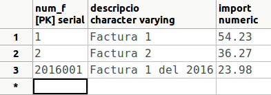
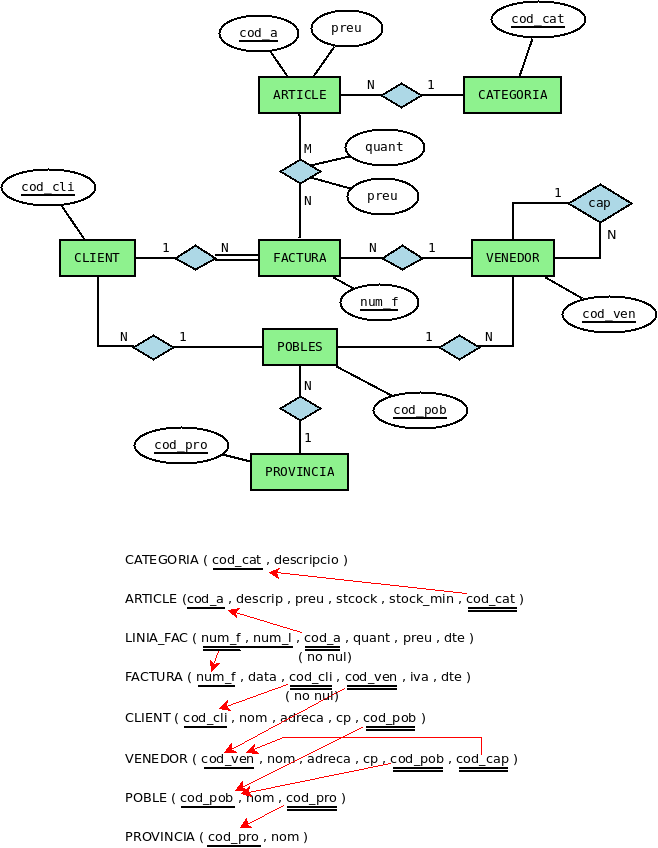

## 2.1 INSERT

Servirá para introducir nuevas filas en una determinada mesa. Hay dos
variantes de esta sentencia. La primera servirá para introducir nuevas filas
proporcionándole los datos, es decir, indicando expresamente los nuevos valores
de los campos. La otra podría servir para introducir nuevas filas de forma más
masiva, cogiendo los datos de las tablas ya existentes por medio de una sentencia
SELECT.

**<u>Sintaxi</u>** 

para inserción con valores

      INSERT INTO tabla [ (campo1 [,campo2 [,...]]) ]  
        VALUAS (valor1 [,valor2 [,...]]) [,(...)]

Como se puede comprobar de esta forma se introducirá una fila nueva, y se
proporcionan los datos directamente, como constantes. Opcionalmente podemos
introducir los valores para una segunda fila o cuántas se quieran, siempre poniendo
los datos de cada fila entre paréntesis, y si hay más de una fila, separados
por comas.

Es opcional poner la lista de campos de la mesa. Si no se ponen, se tendrá que
poner un valor para cada campo de la mesa, y en el mismo orden como están
definidos en la tabla.

Si ponemos expresamente los campos de la mesa, los podremos poner con el orden que
queramos, y no será necesario ponerlos todos. Los campos no especificados quedarán con el
valor nulo (a menos que tengan un valor predeterminado, un valor por defecto).
Por tanto, tendremos que poner obligatoriamente todos los campos definidos como no
nulos (incluida la clave principal).

Para poner el valor nulo en un campo pondremos explícitamente **NULL**.

Si tenemos definido un campo autonumérico (SERIAL) y queremos continuar con el siguiente
de la secuencia, no debemos ponerle ningún valor. Por tanto en la sentencia SQL no
deberá constar el campo: deberemos poner la lista de campos, y en éste no
debe estar el campo autonumérico. Veremos después un ejemplo para verlo más
claro.

Por el contrario, podemos romper la secuencia poniéndole un valor en el campo autonumérico,
pero esto no habrá modificado la secuencia. Si queremos modificarla deberíamos
hacerlo con la sentencia **ALTER SEQUENCE**.

**<u>Ejemplos</u>**

  1) Introducir un departamento nuevo con los siguientes datos: Número: **6** ; Nombre: **Personal** ; Director: **18922222** y Fecha: **01/05/99**.

      INSERT INTO DEPARTAMENTO  
        VALUES (6,'Personal','18922222','01/05/99');

  2) Introducir dos departamentos nuevos, esta vez sin poner la fecha: Número: **7** ; Nombre: **Ventas** ; Director: **18876543**. I Número: **8** ; Nombre: **Internacional** ; Director: **18999999**. Podemos poner además el orden que queramos:

      INSERT INTO DEPARTAMENTO (num_d,director,nombre_d)  
        VALUES (7,'18876543','Ventas') , (8,'18999999','Internacional');

> También lo podíamos haber hecho así. Observe que ahora el orden debe ser exactamente el de la definición de la tabla.

      INSERT INTO DEPARTAMENTO  
        VALUES (7,'Ventas','18876543',NULL) , (8,'Internacional','18999999',NULL);

  3) Introducir 3 empleados en la tabla **EMPLEAT1** , con los siguientes valores (la tabla **EMPLEAT1** la creamos en la primera sentencia de ejemplo de la pregunta 3.2.2, CREATE TABLE):

  * Dni: **11111111a** ; Nombre: **Albert**
  * Dni: **22222222b** ; Nombre: **Berta**
  * Dni: **33333333c** ; Nombre: **Claudia**

        INSERT INTO EMPLEADO1  
          VALUAS ('11111111a','Albert') , ('22222222b','Berta') ,
          ('33333333c','Claudia')

  4) Introducir a 3 empleados en la tabla EMPLEAT2, con los siguientes valores (la tabla **EMPLEAT2** la creamos en la segunda sentencia de ejemplo de la pregunta 3.2.2, CREATE TABLE):

  * Dni: **44444444d** ; Nombre: **David** ; Departamento: **6** ; Sueldo: **1000**
  * Dni: **55555555e** ; Nombre: **Elena** ; Departamento: **6** ; Sueldo: **1500**
  * Dni: **66666666f** ; Nombre: **Ferran** ; Departamento:**7** ; Sueldo: **1750**

        INSERT INTO EMPLEAT2 (dny,nombre,departamento,sueldo)  
          VALUAS ('44444444d ','David ',6,1000) , 
          ('55555555e ','Elena',6,1500) , ('66666666f ','Ferran ',7,1750)

  5) Supongamos que tenemos una tabla de **FACTURAS** en la BD **pruebas** , con una clave principal que es un **autonumérico** (**SERIAL**). Como queremos practicar únicamente el autonumérico, la crearemos sencilita, con la siguiente estructura:

      CREATE TABLE FACTURAS  
        ( num_f SERIAL PRIMARY KEY,  
        descripción VARCHAR,  
        importe NUMERIC );

> La forma de ir introduciendo normalmente será sin especificar num_f, para
> que vaya cogiendo valores consecutivos.

      INSERT INTO FACTURAS (descripcion,importe)  
        VALUAS ('Factura 1',54.23);

> Pero si queremos romper la secuencia, sí pondremos num_f.

      INSERT INTO FACTURAS  
        VALUES (2016001,'Factura 1 de 2016',23.98);

> Eso sí, si introducimos otra fila sin especificar el número de factura,
> lo cogerá de la secuencia, que no se había modificado, y por tanto el valor que
> nos dará será **2**.

      INSERT INTO FACTURAS (descripcion,importe)  
        VALUES ('Factura 2',36.27);

> Para cambiar definitivamente el valor que debe ir autoincrementándose,
> deberíamos modificar la secuencia (**ALTER SEQUENCE**).
>
> Después de las 3 inserciones anteriores, el contenido de la tabla FACTURAS
> será éste:
>
> 

**Sintaxis para inserción con subconsulta**{.azul}

      INSERT INTO tabla [ (campo1 [,campo2 [,...]]) ]  
        SELECT ...

Es decir, los datos que van a insertarse los sacamos a partir de una sentencia
SELECT. La sentencia SELECT puede ser tan complicada como haga falta, y podemos
poner las cláusulas necesarias: WHERE, GROUP BY, ... El requisito es que habrá
de devolver tantos campos como tenga la mesa o como estén especificados en la
sentencia INSERT, y que los datos que vuelven sean del mismo tipo (o tipo
compatibles, aunque Access puede realizar una conversión de tipo automática).
Al igual que en el anterior formato, cuando no se especifique un campo se le asignará
el valor nulo, o el valor predeterminado si tiene definido.

Se puede especificar incluso una tabla de una base de datos externa.
Consulte la sentencia SELECT, el apartado "Especificación de una B.D. externa".

**<u>Ejemplos</u>** 

  1) Insertar todos los registros de la tabla **EMPLEAT1** en **EMPLEAT3** , suponiendo que existen estas tablas y aunque tienen una estructura diferente, ambas tienen los campos **dni** y **nombre**. Si no existe la tabla **EMPLEAT3** , puedes volver a crearla, utilizando la última sentencia de la pregunta 3.2.3 (Restricciones)

      INSERT INTO EMPLEADO3(dny,nombre)  
        SELECT dni,nombre FROM EMPLEAT1;

  2) Insertar en la tabla **EMPLEAT3** todos los empleados de la mesa **EMPLEAT2** de los departamentos 6 y 7.

      INSERT INTO EMPLEADO3  
        SELECT * FROM EMPLEADO2  
        WHERE departamento IN (6,7);

  3) Insertar en la mesa EMPLEAT3 los empleados que tienen más de un familiar. Esta sentencia **no la podremos ejecutar**{.rojo}, puesto que no tenemos la tabla **FAMILIAR**. Está únicamente de forma ilustrativa.

      INSERTAR EN EMPLEADO3  
        SELECT * FROM EMPLEAT  
          DONDE ENTRA EL dni (SELECCIONA dni  
                        DE FAMILIA  
                        GRUPO POR dni  
                        TENIENDO CUENTA(*) > 1);

### :pencil2: Ejercicios {: .ejercicios-header}

Como ya se ha comentado en la introducción, y por no interferir entre nosotros, cada uno se conectará a su Base de Datos **factura_local**.

El esquema Entidad-Relación y el esquema relacional es el siguiente:

**Ex_1** - Insertar en la tabla **CATEGORÍA** las siguientes filas:

**cod_cas** | **descripcion**  
---|---  
BjcOlimpia | Componentes Bjc Seria Olimpia  
Legrand | Componentes marca Legrand  
IntMagn | Interruptor Magnetotérmico  
Niessen | Componentes Niesen Serie Lisa  
  
**Ex_2** - Insertar los siguientes artículos.

**cod_art** | **descrip** | **precio** | **stock** | **stock_min** | **cod_cas**  
---|---|---|---|---|---  
B10028B | Cruzamiento Bjc Serie Olimpia | 4.38 | 2 | 1 | BjcOlimpia  
B10200B | Cruzamiento Bjc Olimpia Cono Visor | 0.88 | 29 |  | BjcOlimpia  
L16550 | Cartucho Fusible Legrand T2 250 A | 5.89 | 1 | 1 | Legrand  
L16555 | Cartucho Fusible Legrand T2 315 A | 5.89 | 3 | 3 | Legrand  
IM2P10L | Interruptor Magnetotermico 2p, 4 | 14.84 | 2 | 1 | IntMagn  
N8008BA | Base Tt Lateral Niessen Trazo Bla | 4.38 | 6 | 6 | Niessen  
  
**Ex_3** - Insertar en la tabla **CLIENTE** tres filas con los siguientes datos

**cod_cli** | **nombre** | **dirección** | **cp** | **cod_pob**  
---|---|---|---|---  
303 | MIRAVET SALA, MARIA MERCEDES | URBANIZACION EL BALCO, 84-11 |  |   
306 | SAMPEDRO SIMO, MARIA MERCEDES | FINELLO, 161 | 12217 |   
387 | TUR MARTIN, MANUEL FRANCISCO | CALLE PEDRO VIRUELA, 108-8 | 12008 |   
  
**Ex_4** - Insertar la siguiente factura:

**num_f** | **fecha** | **cod_cli** | **cod_ven** | **iva** | **dto**  
---|---|---|---|---|---  
6535 | 2015-01-01 | 306 |  | 21 | 10  

**num_f** | **num_l** | **cod_art** | **cuánto** | **precio** | **dto**  
---|---|---|---|---|---  
6535 | 1 | L16555 | 2 | 5.89 | 25  
  
**Ex_5** - Insertar la siguiente factura (esta tiene más de una línea de factura).

**num_f** | **fecha** | **cod_cli** | **cod_ven** | **iva** | **dto**  
---|---|---|---|---|---  
6559 | 2015-02-16 | 387 |  | 10 | 10  

**num_f** | **num_l** | **cod_art** | **cuánto** | **precio** | **dto**  
---|---|---|---|---|---  
6559 | 1 | IM2P10L | 3 | 14.84 |   
6559 | 2 | N8008BA | 6 | 4.38 | 20  

## 2.2 DELETE

Esta sentencia servirá para **borrar filas enteras** de una determinada
mesa.

Si se quieren borrar sólo algunos campos de una o determinadas filas, no
se debe utilizar esta sentencia, sino que se debe utilizar la sentencia
**UPDATE** para poner los campos en NULL.

**<u>Sintaxi</u>**

      DELETE FROM mesa  
        [WHERE condición]

Se borrarán las filas que cumplan la condición. Si no se pone el WHERE
se borrarán tetas las filas de la tabla (pero no la misma tabla,
la estructura; es decir, seguirá existiendo la mesa, pero vacía).

Por la peligrosidad de la sentencia, es conveniente hacer primero una sentencia
SELECT, y cuando estemos seguros de que se seleccionen sólo las filas que queremos
borrar, cambiarla por DELETE. También es muy conveniente realizar copias de
seguridad de las tablas o de toda la Base de Datos.

**<u>Ejemplos</u>**

  1) Borrar todas las filas de **EMPLEAT2**

      DELETE FROM EMPLEADO2;

  2) Borrar de **EMPLEAT3** los empleados del departamento 7

      DELETE FROM EMPLEADO3  
        WHERE departamento=7;

  3) Borrar de **EMPLEAT3** los empleados mayores de 47 años (en realidad no se borrará ninguna porque no tenemos introducida la fecha de nacimiento)

      DELETE FROM EMPLEADO3  
        WHERE EXTRACT(year FROM AGE(CURRENT_DATE,data_nacimiento) )>=47;

  4) Borrar de EMPLEADO aquellos empleados que trabajen en proyectos menos de 20 horas **(no es muy conveniente confirmar la eliminación de los registros, ya que nos quedaríamos sin datos importantes)**{.rojo}

      DELETE FROM EMPLEADO  
        WHERE dni IN (SELECT dni  
                      FROM TRABAJA  
                      GROUP BY dny  
                      HAVING SUM(horas)<20);

### :pencil2: Ejercicios {: .ejercicios-header}

En **factura_local**:

**Ex_6** - Borrar la factura **6559**. Comprobar que también se han borrado las
sus líneas de factura

**Ex_7** - Borrar los artículos de los que **no** tenemos**stock mínimo**.

## 2.3 UPDATE

Esta sentencia servirá para modificar alguno o algunos campos de determinadas
filas de una mesa.

En concreto también servirá para "borrar" el contenido de algún campo de alguna
fila. Lo que haremos será poner en NULL este campo.

**<u>Sintaxi</u>**

      UPDATE tabla  
        SET campo1=valor1 [ ,campo2=valor2 [,...] ]  
        [ WHERE condición];

Pondremos por tanto, después de especificar la tabla, el campo (o campos) que queremos
cambiar seguido del nuevo valor. En caso de querer cambiar más de un campo, irán
separados por comas.

Sólo cambiarán los valores de las filas que cumplan la condición. Si no se
pone condición se modificarán todas las filas.

Haremos la misma consideración de peligrosidad que en el DELETE: es conveniente
hacer primero una sentencia SELECT, y cuando estemos seguros de que se seleccionan
sólo las filas que queremos modificar, cambiarla por UPDATE con la modificación
de los valores. También es muy conveniente realizar copias de seguridad de las tablas o
de toda la Base de Datos.

**<u>Ejemplos</u>**

  1) Borrar todas las fechas de incorporación de la tabla EMPLEAT3

      UPDATE EMPLEADO3  
      SET data_incorporacio=NULL;

  2) Aumentar el sueldo un 5% a los empleados del departamento 6 de la mesa EMPLEAT3.

      UPDATE EMPLEADO3  
      SET sueldo = sueldo * 1.05  
      WHERE departamento=6;

  3) Cambiar la población a Ares y el departamento al 8, a todos los empleados de Castellón de la mesa EMPLEAT3

      UPDATE EMPLEADO3  
      SIETE departamento=8, población='Ares'
      WHERE población='Castellón';

### :pencil2: Ejercicios {: .ejercicios-header}

En **factura_local**:

**Ex_8** - Quitar todos los códigos postales de los clientes.

**Ex_9** - Subir el precio de los artículos de la categoría **BjcOlimpia** un **5%**
(el resultado será que el único artículo de esta categoría habrá pasado de un
precio de 4.38 a **4.60€**)

Licenciado bajo la [Licencia Creative Commons Reconocimiento NoComercial
CompartirIgual 3.0](http://creativecommons.org/licenses/by-nc-sa/3.0/)

