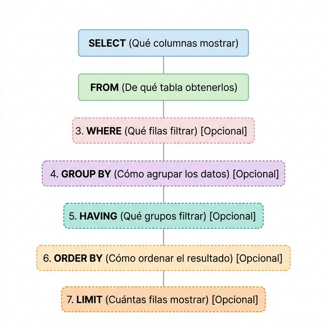

# **1. La consulta SELECT**

Como el mismo nombre indica SQL (_Structured Query Language_), la consulta o
interrogación de la Base de Datos es el alma de SQL. Y la instrucción que nos
lo permite es **SELECT**.

Es una instrucción muy flexible y de mucha potencia, que permite consultar
datos de una o más tablas, filtrar por filas y/o columnas, ordenar el resultado,
agrupar los datos (contando o sumando alguna columna), ... Incluso permite
crear tablas nuevas que serían el resultado de una consulta de otras tablas.

Veremos a continuación la sintaxis general de la instrucción, y posteriormente
cada una de las cláusulas:

**<u>Sintaxi</u>**

    SELECT [DISTINCT] <columnes>  
    [ INTO <clàusula> ]  
    FROM <clàusula>  
    [ WHERE <clàusula> ]  
    [ GROUP BY <clàusula> ]  
    [ HAVING <clàusula> ]  
    [ ORDER BY <clàusula> ]  
    [ LIMITE num1 OFFSET num2 ]

Como veis, las únicas cláusulas obligatorias son la del **SELECT** (donde se llama las columnas que queremos que salgan como resultado) y la del **FROM** (donde se dice de dónde vienen los datos).

!!! note "Nota"
    En PostgreSQL no se distingue entre mayúsculas y minúsculas. Mejor dicho,
    PostgreSQL pasa de mayúsculas a minúsculas todos los nombres de mesa o de campo o
    de lo que sea, salvo si van entre comillas dobles, que entonces se respetan
    mayúsculas y minúsculas. Como cuestión de estilo, yo nunca pongo entre comillas los
    nombres de tablas y campos. Y para una mejor lectura, intentaré poner siempre a los
    nombres de mesa en mayúsculas, y los nombres de campo en minúsculas. También pondré en
    mayúsculas las cláusulas de sentencias SQL (SELECT , FROM , WHERE , ...). Pero
    recuerde que es para una mejor lectura. Podría ir todo en minúsculas
    perfectamente.

Licenciado bajo la [Licencia Creative Commons Reconocimiento NoComercial
CompartirIgual 3.0](http://creativecommons.org/licenses/by-nc-sa/3.0/)

