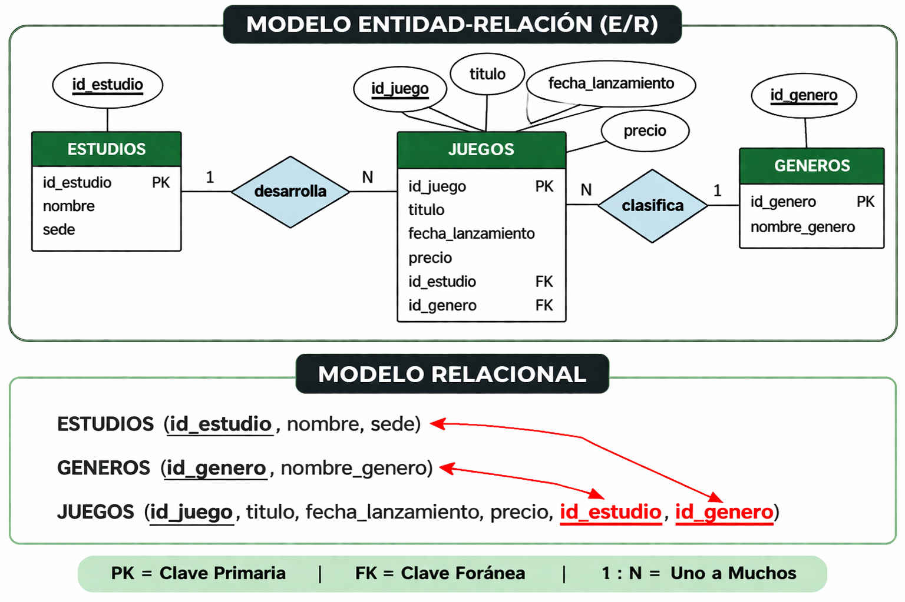
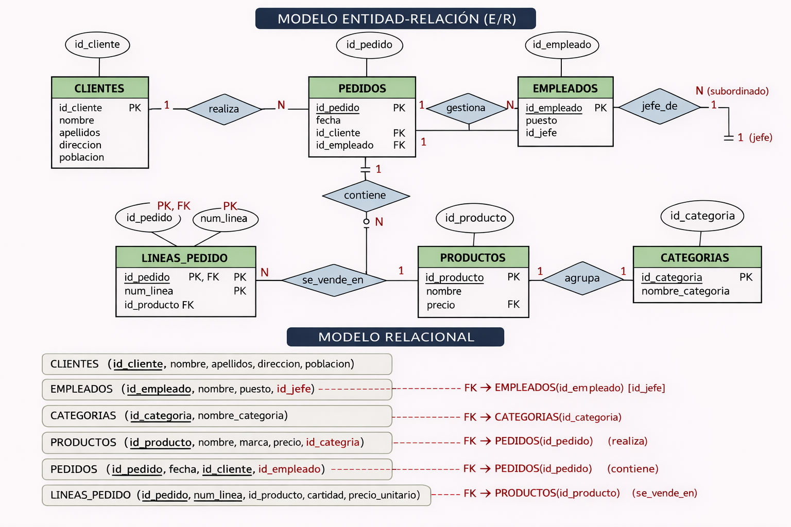

# 3. Esquemas Steamify y TechQuest

Para que el aprendizaje sea más ameno y cercano al desarrollo de aplicaciones web actual, utilizaremos dos entornos de datos modernos: **Steamify** para los ejemplos de las explicaciones y **TechQuest** para los ejercicios prácticos.

**Datos de los ejemplos (Steamify)**{.azul}

Los ejemplos de este tema se basan en **Steamify**, una plataforma simplificada de gestión de videojuegos. Es una base de datos sencilla con 3 tablas principales, ideal para comprender los fundamentos del DQL.

**Datos de los ejercicios (TechQuest)**{.azul}

Para los ejercicios trabajaremos con **TechQuest**, un e-commerce de productos tecnológicos y gaming más completo que nos permitirá realizar consultas más avanzadas.

Puedes encontrar el script completo para montar estas bases de datos en tu entorno local en el archivo [database_setup.sql](database_setup.sql).

Licenciado bajo la [Licencia Creative Commons Reconocimiento NoComercial
CompartirIgual 3.0](http://creativecommons.org/licenses/by-nc-sa/3.0/)

