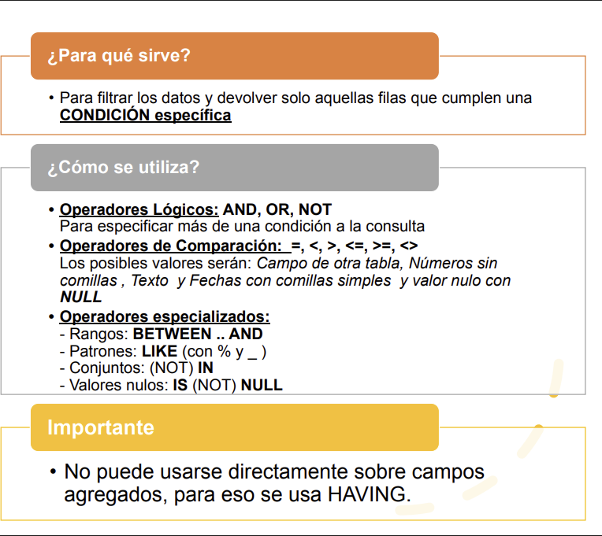

# 4. La cláusula WHERE

Nos servirá para establecer filtros. Sólo saldrán las filas que satisfagan la
condición del filtro.

**<u>Sintaxi</u>**

    SELECT <columnes>  
      FROM <taules>  
      WHERE <condició>;

La condición podrá ser una o más de una, unidas en este caso por los operadores
lógicos **AND** , **OR** y **NOT**. Cada condición será una comparación entre
expresiones, donde pueden entrar columnas, constantes, parámetros, funciones válidas
de PostgreSQL, ... unidas por operadores aritméticos. Los operadores que se pueden
utilizar para hacer las comparaciones son:

<!--
  * **<  <=    =   >= > <> (!=)** (distinto)

  * **BETWEEN** _valor1_**AND** _valor2_ (los valores comprendidos entre valor1 y valor2)

  * **IN** (_lista_de_valors_) si el valor con el que se compara está en la lista de valores (entre paréntesis y valores separados por comas)

  * También podemos utilizar **LIKE** en la condición. En los ejemplos 4, 7 y 8 se ve su utilización. El operador LIKE se utiliza junto con los caracteres "**comodino**": 
  * **%** (equivale a 0 o más caracteres, los que sea)
  * **_** (1 y sólo un carácter, eso sí, lo que sea).

  * **IS [NOT]** es un operador especial para comparar con el valor nulo (**NULL**).
-->
Recordemos por otro lado cómo se escriben las constantes:

  * las constantes **numéricas** van tal cual, sin comillas ni nada (con el **punto** decimal, y no coma decimal)

  * las constantes **alfanuméricas** (de texto) van entre comillas simples

  * las constantes de fecha van entre comillas simples, y PostgreSQL ya hará la conversión

  * por último el valor nulo se escribe **NULL**

**<u>Ejemplos</u>**

1) Sacar los estudios cuya sede está en **Japón**.

    SELECT *  
      FROM estudios  
      WHERE sede LIKE '%Japón%';

2) Sacar todos los juegos que son del género **RPG** (id_genero = 2).

    SELECT *  
      FROM juegos  
      WHERE id_genero = 2;

3) Sacar los juegos del estudio **CD Projekt Red** con un precio superior a **40 €**.

    SELECT *  
      FROM juegos  
      WHERE id_estudio = 3 AND precio > 40;

4) Sacar los productos de las categorías **1, 2 o 3**.

    SELECT *  
      FROM productos  
      WHERE id_categoria = 1 OR id_categoria = 2 OR id_categoria = 3;

    SELECT *  
      FROM productos  
      WHERE id_categoria >= 1 AND id_categoria <= 3;

    SELECT *  
      FROM productos  
      WHERE id_categoria BETWEEN 1 AND 3;

    SELECT *  
      FROM productos  
      WHERE id_categoria IN (1, 2, 3);

5) Sacar los juegos del estudio **O'Reilly Games** (Ejemplo de cómo manejar la comilla simple doblándola).

    SELECT *  
      FROM estudios  
      WHERE nombre = 'O''Reilly Games';

6) Sacar el título de los juegos que comienzan por **E**.

    SELECT titulo  
      FROM juegos  
      WHERE titulo LIKE 'E%';

7) Sacar los juegos que tienen exactamente **5** caracteres en su título (usando `_`).

    SELECT *  
      FROM juegos  
      WHERE titulo LIKE '_____';

8) Sacar todos los juegos cuyo título solo consta de una palabra (no tienen espacios en blanco).

    SELECT *  
      FROM juegos  
      WHERE titulo NOT LIKE '% %';

9) Sacar a los empleados que no tienen asignado un jefe (id_jefe es nulo).

    SELECT *  
      FROM empleados  
      WHERE id_jefe IS NULL;

## :pencil2: Ejercicios

En la BD **TechQuest**, conectando como usuario **tech_alu**:

**Ex_7** Sacar los **clientes** de la **población** 'Madrid'.

**Ex_8** Sacar todos los **pedidos** del mes de **marzo** de **2024**.

**Ex_9** Sacar todos los **productos** de la **categoría** 'Gaming' con un **stock** entre **2** y **7** unidades.

**Ex_10** Sacar todos los **clientes** que **no** tienen introducida la **dirección**.

**Ex_11** Sacar todos los **productos** con el **stock** introducido pero que **no** tienen introducido el **stock mínimo**.

**Ex_12** Sacar todos los **clientes** cuyo **apellido** es **VILLALONGA**.

**Ex_13.a** Modificar lo anterior para sacar todos los que son **VILLALONGA** de **primer** o de **segundo** apellido.  
**Ex_13.b** Modificar lo anterior para sacar todos los que **no** son **VILLALONGA** ni de primer ni de segundo apellido.

**Ex_14** Sacar los **productos** de la marca "**Razer**" (o cuyo nombre contiene esta palabra), cuyo **precio** oscila entre **20 y 100 €** y de los que tenemos un **stock** estrictamente **mayor** que el **stock mínimo**.

Licenciado bajo la [Licencia Creative Commons Reconocimiento NoComercial
CompartirIgual 3.0](http://creativecommons.org/licenses/by-nc-sa/3.0/)

