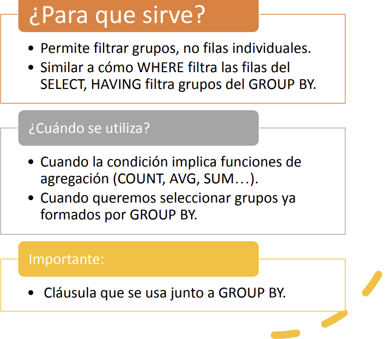

# 7. La cláusula HAVING

Esta cláusula acompaña normalmente a la de **GROUP BY**, y servirá pera
poder elegir algunos grupos que cumplan una determinada condición.

**Funciones numéricas**{.azul}

También podríamos decir que el HAVING está en el GROUP BY, lo que el WHERE está en el SELECT

**<u>Sintaxi</u>**

    SELECT <columnes>  
      FROM <taules>  
      [GROUP BY <columnes>]  
      HAVING <condició>

Únicamente comentaremos el caso en el que acompaña al GROUP BY. Y como hemos dicho, el
que hace es filtrar los grupos: de los grupos resultantes del GROUP BY, sólo saldrán
quienes cumplan la condición.

Esta condición contendrá alguna función de agregado o contendrá columnas
incluidas en el GROUP BY. Fíjese que es lógico, ya que sirve para elegir
grupos una vez hechos, y entonces ya no se podrá ir a un elemento del grupo.

Por ejemplo, esta sentencia servirá para sacar los estudios que tienen más de 2 juegos registrados en la plataforma:

    SELECT id_estudio, COUNT(*)  
      FROM juegos  
      GROUP BY id_estudio  
      HAVING COUNT(*) > 2;

**<u>Ejemplos</u>**

  1) Sacar aquellos estudios que tienen más de un juego que comienza por la palabra 'Half-Life'. De momento solo sacaremos el ID del estudio.

    SELECT id_estudio, COUNT(*)  
      FROM juegos  
      WHERE titulo LIKE 'Half-Life%'  
      GROUP BY id_estudio  
      HAVING COUNT(*) > 1;

  2) Calcular el precio máximo, el mínimo y el precio medio de los juegos de aquellos estudios que tienen más de 2 juegos en el catálogo.

    SELECT id_estudio, COUNT(*) AS "Número de juegos", MAX(precio) AS Máximo, MIN(precio) AS Mínimo, AVG(precio) AS Media  
      FROM juegos  
      GROUP BY id_estudio  
      HAVING COUNT(*) > 2;

  3) Sacar el precio medio de aquellos estudios cuya media de precios de juegos es superior a 50 €.

    SELECT id_estudio, AVG(precio) AS "Precio Medio"  
      FROM juegos  
      GROUP BY id_estudio  
      HAVING AVG(precio) > 50;

## :pencil2: Ejercicios {: .ejercicios-header}

**Ex_28** Calcular la media de cantidades pedidas de aquellos **productos** que se han pedido más de dos veces (contando cuántas veces aparece en las líneas de pedido).

**Ex_29** Sacar las **poblaciones** que tienen entre 3 y 7 **clientes**. Mostrar solo el nombre de la población y el número de clientes.

**Ex_30** Sacar las **categorías** que tienen más de un producto "caro" (de más de 500 €).

**Ex_31** Sacar a los **clientes** que tienen más de un **pedido**, mostrando el número de pedidos.

**Ex_32** Modificar lo anterior para sacar a los clientes que tienen más de un pedido en el primer trimestre.

**Ex_33** Calcular el total de cada **pedido** de aquellos que tienen 10 o más líneas de pedido, sin aplicar descuentos ni IVA, y también aplicando el descuento que consta en la línea de pedido. Utilice la función `COALESCE(descuento_linea, 0)` para tratar los nulos.

Licenciado bajo la [Licencia Creative Commons Reconocimiento NoComercial
CompartirIgual 3.0](http://creativecommons.org/licenses/by-nc-sa/3.0/)

