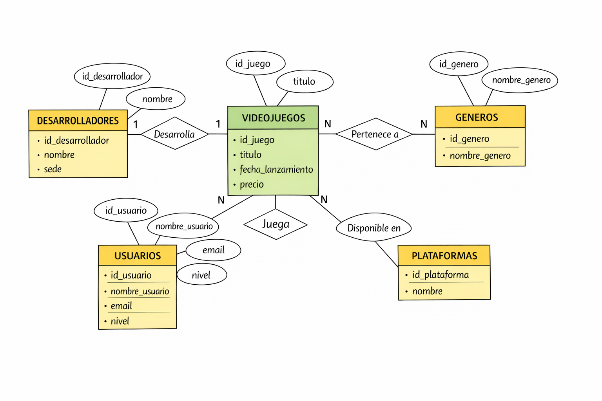
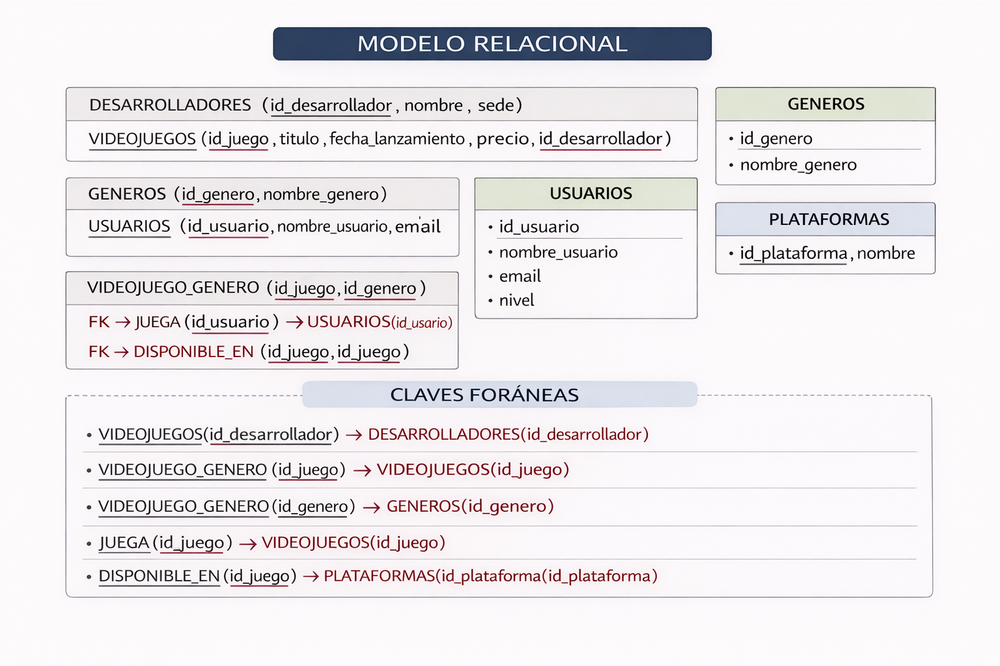
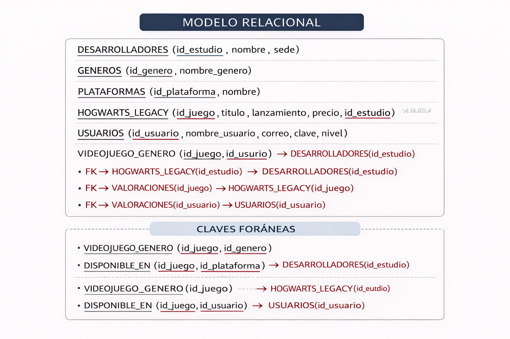
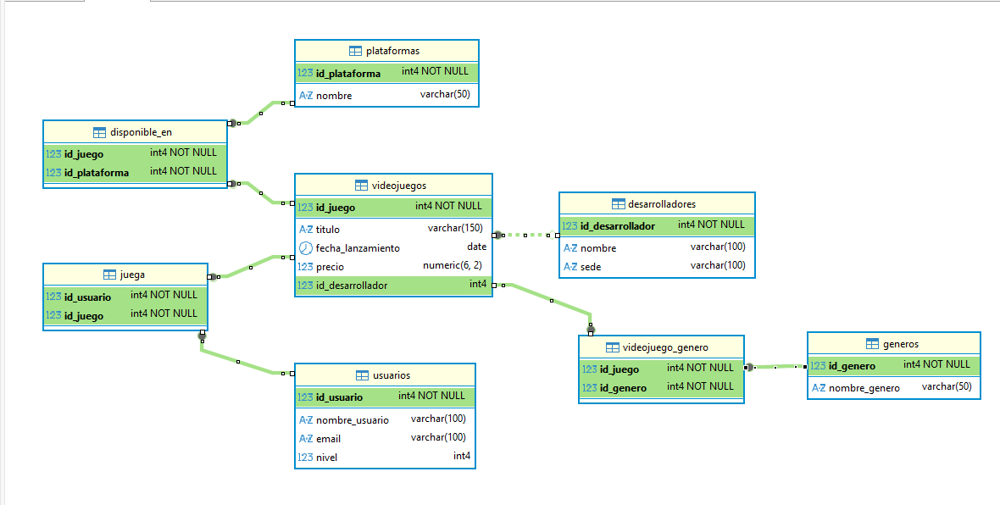
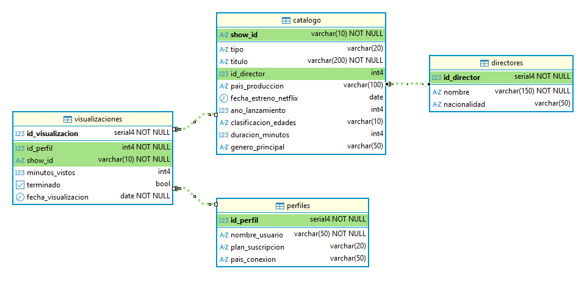
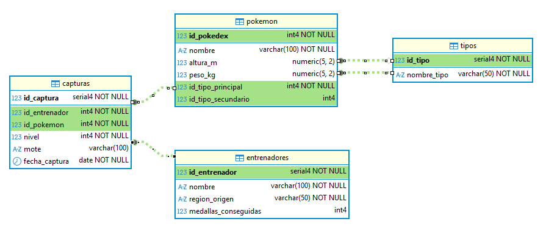

# **Ejemplos de BDs**

## **BD Juego**

Una empresa desarrolla un videojuego que puede estar disponible en varias plataformas (PC, consola, etc.).
Los usuarios pueden jugar al videojuego y realizar valoraciones sobre él.
Además, cada videojuego pertenece a uno o varios géneros (acción, RPG, aventura, etc.).

📘 EJERCICIOS DQL — UNA SOLA TABLA

1. Mostrar todos los datos de la tabla VIDEOJUEGOS
2. Mostrar solo el título y el precio de los videojuegos
3. Mostrar todos los datos de los usuarios
4. Mostrar los nombres de todas las plataformas
5. Mostrar el nombre y la sede de los desarrolladores
6. Mostrar los videojuegos cuyo precio sea mayor que 50
7. Mostrar los usuarios con nivel mayor o igual a 10
8. Mostrar los videojuegos lanzados después de 2020
9. Mostrar los desarrolladores cuya sede sea "Tokyo"
10. Mostrar los videojuegos con precio entre 20 y 60
11. Mostrar los usuarios cuyo nombre empiece por "A"
12. Mostrar los videojuegos ordenados por precio de mayor a menor
13. Mostrar los videojuegos más baratos primero y solo los 3 primeros
14. Mostrar los videojuegos con precio distinto de 50
15. Mostrar los usuarios cuyo nivel esté entre 5 y 15
16. Mostrar el precio máximo de los videojuegos
17. Mostrar el precio mínimo de los videojuegos
18. Mostrar el precio medio de los videojuegos
19. Contar cuántos usuarios hay en la base de datos
20. Mostrar cuántos videojuegos hay
21. Mostrar los videojuegos cuyo título contenga la palabra "Legacy"
22. Mostrar los usuarios cuyo email termine en ".com"

📘 EJERCICIOS JOIN — VIDEOJUEGOS

1. Mostrar el título de los videojuegos junto con el nombre de su desarrollador
2. Mostrar el título, precio y desarrollador de cada videojuego
3. Mostrar el nombre de los usuarios y los juegos a los que juegan
4. Mostrar el título de los juegos y sus géneros
5. Mostrar el título de los juegos y las plataformas en las que están disponibles
6. Mostrar los usuarios que juegan a videojuegos del género "RPG"
7. Mostrar los videojuegos desarrollados por empresas cuya sede esté en Japón
8. Mostrar los videojuegos disponibles en la plataforma "PC"
9. Mostrar los usuarios que juegan al videojuego "Fortnite"
10. Mostrar el título del videojuego, su género y su desarrollador
11. Mostrar el número de usuarios que juegan a cada videojuego
12. Mostrar el precio medio de los videojuegos por desarrollador
13. Mostrar los videojuegos que tienen más de 2 usuarios
14. Mostrar el número de videojuegos que hay en cada género
15. Mostrar los videojuegos disponibles en más de una plataforma
16. Mostrar el usuario que juega a más videojuegos
17. Mostrar el videojuego más caro de cada desarrollador
18. Mostrar los usuarios que juegan a videojuegos con precio mayor que 50
19. Mostrar los videojuegos que pertenecen a más de un género

📘 EJERCICIOS CON SUBCONSULTAS — VIDEOJUEGOS

🟢 NIVEL BÁSICO

1. Mostrar los videojuegos cuyo precio sea mayor que el precio medio de todos los videojuegos
2. Mostrar los videojuegos más caros que “Elden Ring”
3. Mostrar los usuarios cuyo nivel sea mayor que el nivel medio
4. Mostrar los videojuegos más baratos que el precio medio
5. Mostrar los desarrolladores que tienen videojuegos más caros que 50
🟡 NIVEL MEDIO

6. Mostrar los videojuegos que tienen el precio máximo
7. Mostrar los usuarios que juegan a algún videojuego (usando subconsulta)
8. Mostrar los videojuegos que tienen al menos un usuario jugando
9. Mostrar los usuarios que no juegan a ningún videojuego
10. Mostrar los videojuegos cuyo desarrollador esté en Japón

🟠 NIVEL MEDIO-ALTO

11. Mostrar los videojuegos que tienen más usuarios que la media
12. Mostrar los usuarios que juegan a más videojuegos que la media
13. Mostrar los desarrolladores que tienen más videojuegos que la media
14. Mostrar los videojuegos que pertenecen a más de un género
15. Mostrar los videojuegos disponibles en más plataformas que la media

🔴 NIVEL AVANZADO

16. Mostrar el usuario que juega a más videojuegos (usando subconsulta)
17. Mostrar los videojuegos más jugados
18. Mostrar los desarrolladores cuyos videojuegos tienen un precio medio superior a la media global
19. Mostrar los usuarios que juegan a videojuegos cuyo precio es mayor que el precio medio
20. Mostrar las plataformas que tienen más videojuegos que la media

## **BD Netflix**

📄 ENUNCIADO — Base de Datos NETFLIX

Se desea diseñar y trabajar con una base de datos que represente el funcionamiento básico de una plataforma de streaming similar a Netflix.

Esta base de datos almacena información sobre el catálogo de contenidos, los usuarios (perfiles) y el historial de visualización.

🧩 Descripción del sistema

La plataforma dispone de un catálogo de contenidos que incluye tanto películas como series. Cada contenido puede estar dirigido por un director, aunque en algunos casos esta información puede no estar disponible.

Los usuarios acceden a la plataforma a través de perfiles, cada uno con un tipo de suscripción y un país desde el que se conectan.

Cada vez que un usuario visualiza un contenido, se registra la visualización indicando cuánto tiempo ha visto, si ha terminado el contenido y la fecha en la que se produjo.

   

📘 EJERCICIOS SQL — NETFLIX (50 EJERCICIOS)

🟢 NIVEL BÁSICO (1–10)

1. Mostrar todos los datos de la tabla catalogo
2. Mostrar el título y tipo de todos los contenidos
3. Mostrar los nombres de todos los directores
4. Mostrar los perfiles y su plan de suscripción
5. Mostrar los títulos de las películas
6. Mostrar los títulos de las series
7. Mostrar los contenidos producidos en Estados Unidos
8. Mostrar los contenidos con clasificación '+18'
9. Mostrar los perfiles que tienen plan Premium
10. Mostrar los contenidos lanzados después de 2015

🟡 NIVEL MEDIO (11–20)

11. Mostrar los contenidos con duración mayor a 120 minutos
12. Mostrar los contenidos entre 2010 y 2020
13. Mostrar los contenidos cuyo título contenga "Game"
14. Mostrar los contenidos ordenados por año descendente
15. Mostrar los perfiles ordenados por nombre
16. Mostrar el número total de contenidos
17. Mostrar el número de perfiles por país
18. Mostrar la duración media de los contenidos
19. Mostrar el año mínimo de lanzamiento
20. Mostrar el año máximo de lanzamiento

🟠 NIVEL MEDIO-ALTO (JOIN) (21–35)

21. Mostrar el título del contenido y el nombre del director
22. Mostrar los contenidos con su nacionalidad del director
23. Mostrar los perfiles y los contenidos que han visto
24. Mostrar los contenidos visualizados por cada perfil
25. Mostrar los contenidos que han sido visualizados
26. Mostrar los perfiles que han visto contenidos
27. Mostrar los contenidos con sus visualizaciones
28. Mostrar el número de visualizaciones por contenido
29. Mostrar el número de visualizaciones por perfil
30. Mostrar los contenidos vistos por perfiles Premium
31. Mostrar los contenidos vistos en España
32. Mostrar los contenidos con su director y país
33. Mostrar los contenidos que no tienen director
34. Mostrar los perfiles que han terminado algún contenido
35. Mostrar los contenidos no terminados por los usuarios

🔵 NIVEL AVANZADO (JOIN + GROUP BY) (36–40)

36. Mostrar el contenido más visto
37. Mostrar el perfil que más visualizaciones tiene
38. Mostrar la media de minutos vistos por contenido
39. Mostrar la media de minutos vistos por perfil
40. Mostrar los contenidos con más de 2 visualizaciones

🔴 NIVEL MUY AVANZADO (SUBCONSULTAS) (41–50)

41. Mostrar los contenidos cuyo precio (simulado por duración) sea mayor que la media
42. Mostrar los contenidos con duración mayor que la media
43. Mostrar los perfiles cuyo número de visualizaciones es mayor que la media
44. Mostrar los contenidos más vistos (usando subconsulta)
45. Mostrar el perfil que más contenido ha visto (subconsulta)
46. Mostrar los contenidos que han sido vistos por todos los perfiles
47. Mostrar los perfiles que han visto todos los contenidos
48. Mostrar los contenidos que no han sido vistos por ningún perfil
49. Mostrar los perfiles que no han visto ningún contenido
50. Mostrar los contenidos cuya duración es igual a la máxima

## **BD POKEMON**

📄 ENUNCIADO — Base de Datos POKÉMON

Se desea diseñar y trabajar con una base de datos que represente el mundo Pokémon, donde se almacena información sobre los Pokémon, sus tipos y los entrenadores que los capturan.

🧩 Descripción del sistema

En este sistema existen diferentes especies de Pokémon, cada una con uno o dos tipos elementales (por ejemplo, fuego, agua, planta, etc.).

Los entrenadores recorren distintas regiones y capturan Pokémon, pudiendo tener varios en su equipo. Cada Pokémon puede ser capturado por distintos entrenadores.

Cada captura queda registrada, indicando el nivel del Pokémon, un posible mote (nombre personalizado) y la fecha en la que fue capturado.

📘 EJERCICIOS SQL — POKEMON (50 EJERCICIOS)